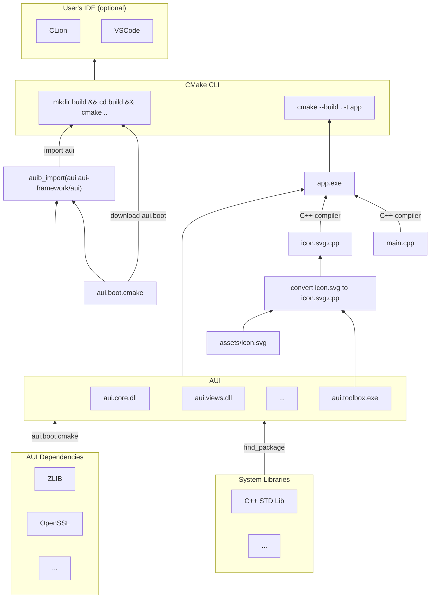
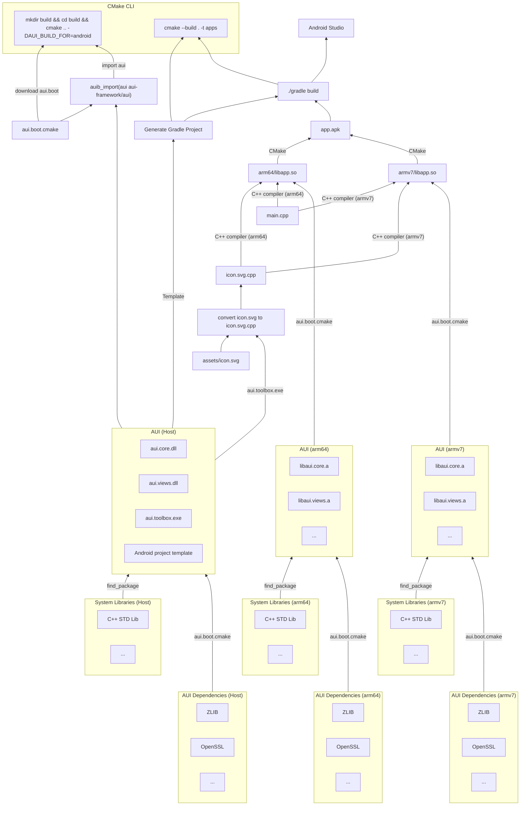

# App Build Overview

This page describes how an AUI application is built.

## Trivia

On this page, libraries and executables are represented with [windows] file name extensions with shared linking.
Other platforms and configurations follow the same principles but with different file types.

- LIBRARY.dll refers to a binary (compiled) representation of LIBRARY
- PROGRAM.exe refers to a binary (compiled) representation of PROGRAM (executable)

Also, on this page, the build system is demonstrated on [minimal-ui-template-with-assets](minimal_ui_assets.md).

## Generic scenario { #BUILD_SCENARIO_GENERIC }

The most common and straightforward scenario. CMake handles everything.

This is applicable for most desktop platforms.

Things to note:

- [aui.boot] is downloaded in your `CMakeLists.txt`, which downloads AUI itself and all its dependencies.
- Among with AUI libraries, there's `aui.toolbox`, which participates in the build process. In particular, it converts
  [aui-assets] to cpp files, compressing them, making them available in the application, effectively embedding them to
  the application binary.

## Mobile scenario

On mobile platforms, the build process is overcomplicated by:

- Need to support multiple architectures (ARM, x86, etc)
- Platform specific packaging requirements (APK, IPA)
- Integrating with platform-specific build systems (Gradle, Xcode)
- Interfacing to Kotlin/Swift (Java/Objective-C) from/to C++
- Deliver Kotlin/Swift (Java/Objective-C) platform-specific code through CMake

In this section, we'll consider Android (armv7 + arm64) as the target platform and Windows as the build host platform.
On combinations of the other host/target platforms, the build process remains similar.

Things to note:

- Mobile scenario slightly resembles [BUILD_SCENARIO_GENERIC].
- There are multiple CMake processes: one of the host, which defines `apps` meta target, which invokes Gradle, which
  invokes another CMakes per architecture, supplying `CMAKE_TOOLCHAIN`.
- There are several AUI instances: for the host platform, arm64 (for the target) and armv7 (for the target).
- The host version of AUI supplies `aui.toolbox`, which is used to compile assets; and a copy of Gradle/Xcode project
  to generate from. Also, this template delivers Kotlin/Swift platform code of AUI.
- Libraries (the components defined with [aui_module]) are built statically. This is needed to avoid code signing
  hell on iOS.
- On Android, the application executable (the one defined with [aui_executable]) is compiled as a shared library,
  because JVM is the executable of an Android application, which is then loads a shared library containing native code.