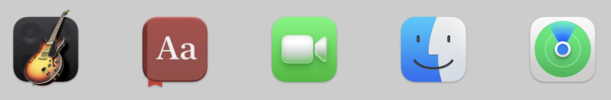

# App Icon

The app icon is an important part of any software product, representing your brand identity and conveying the purpose of
your project. It's often one of the first things users see when they discover a new application, setting a tone for
overall user experience. Approach to app icon briefly resembles the overall quality of the product.

While making distinct visuals for every platform can be challenging, AUI is here to help you to produce
professional-grade app icons while preserving targeted platform's specifics.

[aui_app.md] is a CMake command provided by AUI that defines platform-specific technical information about your
application, including [ICON](#aui_app_ICON).

```cmake
aui_app(TARGET app_target
        NAME "My App"
        ICON "icon.svg")
```

`aui.toolbox` is used by `aui_app` to convert icon to platform-specific formats.

AUI forces you to use SVG to ensure your icon renders correctly on all platforms.
In addition, the usage of SVG avoids image pixelization on HiDPI (High Dots Per Inch) displays.

If you only have images in raster formats (such as PNG, ICO, etc.) you need to vectorize by tracing the image.
Modern vector image editors (such as Adobe Illustrator or Inkscape) have built-in tools to perform this procedure. If you wish, you can also use various online vectorizers.

## Vectorization using Inkscape

For instance, let's see how to vectorize your image using Inkscape editor. Just follow the next instruction:
* First, import a suitable bitmap image by using the menu File → Import.
* Select the image with the Selector tool.
* In the menu, go to Path → Trace Bitmap.
* A dialog will open where you can set different options. Play with them a little to get a better result.
* When the result of the preview looks right, click Ok. The vectorized image will be available right on the canvas.
* Remove your old raster bitmap and export got image in SVG format.

## Known issues

* AUI's SVG renderer does not show up SVG paths. The easiest solution is convert paths to polygons (shapes) in modern vector editor.

## Shaping

Modern operating systems tend to enforce icon shape to unify their launchers. For example, iOS is known for its
distinctive "squircle" shape, a unique combination of square and circle with subtle curvature that deviates from the
more traditional rounded rectangle. In Android the user is allowed to choose between rectangle, rounded rectangle,
circle and squircle shapes. Moreover, it features a clear distinction between background and foreground layers so the
icon can be animated.

For that being said, a typical shape-agnostic app icon consists of:

- a **background** layer which is a neutral solid color, such as black or white, or featuring an accent color.
  Occasionally, it may incorporate gradients or abstract shapes to add visual interest. As the background layer often
  gets masked, its simplicity is key - it doesn't clutter the icon with important visual information, instead using
  colors playfully.
- a **foreground** layer(s) that typically holds a logo or other critical graphics. To ensure clean look it should be
  padded to fit naturally within icon's boundary which as was mentioned may differ.

On the other hand, Windows and Linux applications tend to have non-uniform shapes.

<div class="dark-mode-keep-imgs">
<table>
<tr>
<th>Platform</th>
<th>Sample Visuals</th>
<th>Guidelines</th>
</tr>
<tr>
<td colspan="3" style="text-align: center"><i> - forced shape trend - </i></td>
</tr>
<tr>
<td>Android</td>
<td> </td>
<td><a href="https://developer.android.com/distribute/google-play/resources/icon-design-specifications">Google</a></td>
</tr>
<tr>
<td>iOS</td>
<td rowspan="2"> </td>
<td rowspan="2">
  <a href="https://developer.apple.com/design/human-interface-guidelines/app-icons">Apple Developer</a><br/>
  <a href="https://developer.apple.com/design/resources/#macos-apps">Apple Design Resources</a>
</td>
</tr>
<tr>
<td>macOS<br/>(with some exceptions)</td>
</tr>
<tr>
<td colspan="3" style="text-align: center"><i> - freeform trend - </i></td>
</tr>
<tr>
<td>Windows</td>
<td> </td>
<td><a href="https://learn.microsoft.com/en-us/windows/apps/design/style/iconography/app-icon-design">Microsoft</a></td>
</tr>
<tr>
<td rowspan="3">Linux</td>
<td rowspan="3">


</td>
<td><a href="https://docs.flathub.org/docs/for-app-authors/metainfo-guidelines/quality-guidelines/">Flathub</a></td>
</tr>
<tr>
<td><a href="https://developer.gnome.org/hig/guidelines/app-icons.html">GNOME</a></td>
</tr>
<tr>
<td><a href="https://develop.kde.org/hig/icons/colorful/">KDE</a></td>
</tr>
</table>
</div>
