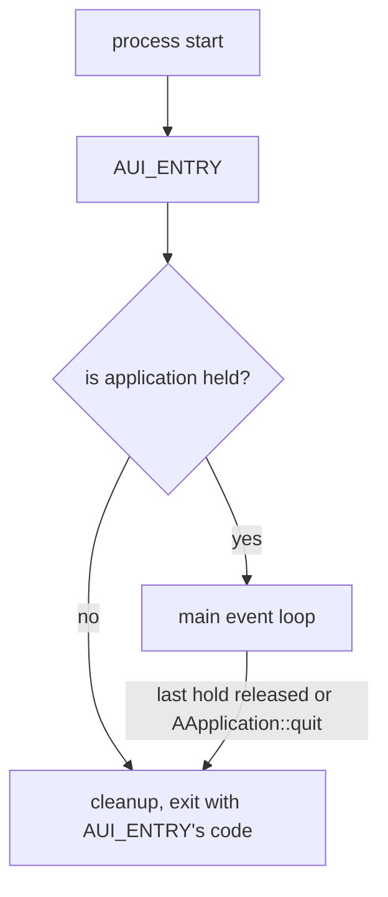
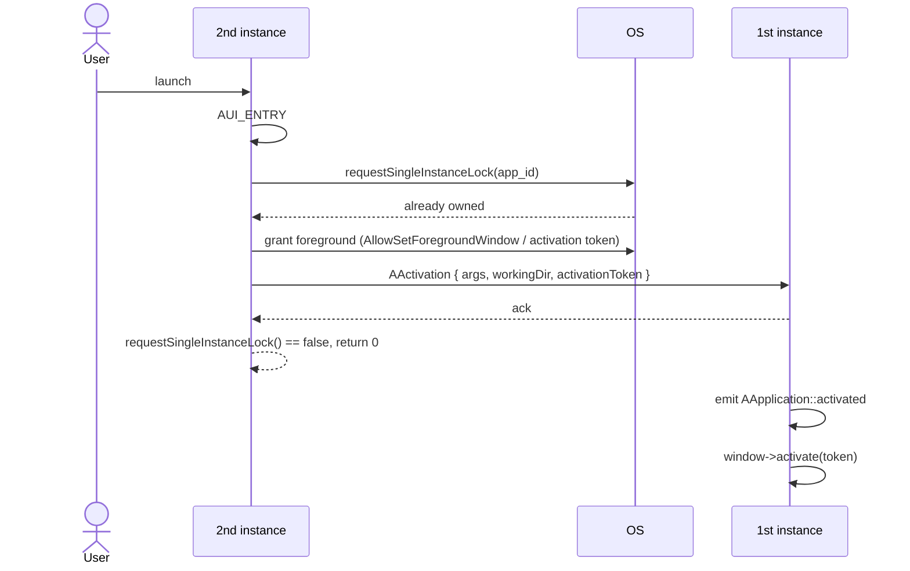

# Application lifetime & instancing

This page explains:

- when an AUI application exits;
- how to keep it running without windows (background, tray, daemon);
- what happens when the user launches an application that is already running, and how to make it
  single instanced.

## Lifetime

`AUI_ENTRY` is not your main loop. On desktop platforms, AUI runs the main event loop **after** `AUI_ENTRY` returns,
while something *holds* the application:



The application is held while:

| Condition | Default |
|-|-|
| at least one `AWindow` is shown (not closed; hidden windows still count) | yes, controlled by `AApplication::inst().quitOnLastWindowClosed` |
| at least one `AApplication::Hold` exists | none |

`AApplication::quit(exitCode)` stops the loop regardless of holds.

### Behaviour by application type

| Application type | Holds after `AUI_ENTRY` | Result | Code changes |
|-|-|-|-|
| CLI, `aui::core` only | 0 | exits right after `AUI_ENTRY` | none |
| CLI, linked with `aui::views`, no windows shown | 0 | exits right after `AUI_ENTRY` | none |
| UI, `_new<MyWindow>()->show()` | windows | runs until the last window is closed | none |
| UI with background mode | windows + `hold()` | runs until `quit()` or all holds are released | opt-in |
| Daemon without windows | `hold()` | runs `AEventLoop` until `quit()` | opt-in |
| Embedded ([SDL](examples.md), GLFW, custom loop via `AGLEmbedContext`) | 0 | your loop runs inside `AUI_ENTRY`, then exits | none |
| Android, iOS | n/a | the OS controls the lifetime | none |

!!! note "CLI applications"

    `AUI_ENTRY` is a regular entry point for console utilities, including the ones linked with `aui::views`. Linking
    `aui::views` alone does not make the application stay alive: if you don't show an `AWindow` and don't call
    `AApplication::hold()`, the process exits right after `AUI_ENTRY` returns, just like a plain `main`.

!!! note "Embedding AUI into another windowing toolkit (SDL, GLFW, etc.)"

    Such applications run their own loop inside `AUI_ENTRY` and must call `AThread::processMessages()` regularly.
    `AGLEmbedContext` is not an `AWindow`, so it does not hold the application; holds and `AApplication::quit()` do
    not affect your loop. AUI does not install process-wide handlers (like NSApplication delegate) and does not
    initialize the native platform abstraction unless you show an `AWindow`.

    Single instance lock works in embedded applications, too: `activated` is delivered through the AUI message queue,
    so it is emitted from your `AThread::processMessages()` call.

### Keeping the application alive without windows

```cpp
class Tracker: public AObject {
public:
    // the application keeps running while Tracker is alive, even if all windows are closed
    _<AApplication::Hold> hold = AApplication::inst().hold();
    ...
};
```

!!! warning

    `AUI_ENTRY` returns before the main loop starts. A `Hold` stored in a local variable of `AUI_ENTRY` is released
    right away. Store it in a long-living object.

!!! warning

    A held application without windows is invisible for the user. Provide a way to bring the window back:
    single instance activation (see below), a tray icon, or a global shortcut. Otherwise, the user would only be
    able to kill the process.

## Multiple instances

`AUI_ENTRY` is called **every time the executable is launched**, including when the user tries to launch an
application that is already running (clicks the desktop shortcut again, opens it from the start menu, etc.).

By default, each launch is an independent process:

| Platform | Default | Single instance |
|-|-|-|
| Windows | multi instance | `AApplication::requestSingleInstanceLock()` |
| Linux | multi instance | `AApplication::requestSingleInstanceLock()` |
| macOS | single instance (Launch Services); `open -n` makes new ones | `AApplication::requestSingleInstanceLock()`; clicking the Dock icon emits `activated` |
| Android | single instance (OS) | always |
| iOS | single instance (OS) | always |
| Emscripten | each browser tab is an instance | not applicable |

### Single instance application

Call `AApplication::requestSingleInstanceLock()` at the very beginning of `AUI_ENTRY`. It returns `false` if another
instance is already running. In that case, the activation of the current process (arguments, working directory,
activation token) has already been delivered to the running instance, and you should just return:

```cpp
#include <AUI/Platform/Entry.h>
#include <AUI/Platform/AApplication.h>

AUI_ENTRY {
    if (!AApplication::inst().requestSingleInstanceLock()) {
        // another instance is running and has been notified
        return 0;
    }

    auto window = _new<MainWindow>();
    window->show();

    AObject::connect(AApplication::inst().activated, window, [window = window.get()](const AActivation& activation) {
        // somebody launched the application again: bring the window to front
        window->activate(activation.activationToken);
    });
    return 0;
}
```

- the lock key defaults to the application id specified in [aui_app] (`ID`). If the id is not set, the call throws,
  otherwise unrelated AUI applications would share the same lock. You can also pass a custom key; for example,
  include a profile name in it to have one instance per profile.
- `activated` is emitted on the main thread. It is **not** emitted for the first launch; handle that in `AUI_ENTRY`.
- `AActivation::args` contains the full command line of the launched process, including `argv[0]`.



Forwarding is synchronous: when `requestSingleInstanceLock()` returns `false`, the primary instance has already
received the message.

The lock is released by the OS if the primary instance crashes, so a stale lock never prevents the application from
starting.

### Single instance application with a background process

A typical pattern for trackers, messengers, sync clients, etc.:

- the application works in background (no windows), optionally started by autorun with `--background`;
- closing the window just hides it and the application keeps working;
- launching the application again shows the existing window instead of starting a new process.

```cpp
#include <AUI/Platform/Entry.h>
#include <AUI/Platform/AApplication.h>

class App: public AObject {
public:
    App() {
        // keep working when there are no windows. For a user-initiated exit, call AApplication::inst().quit()
        // (e.g. from a "Quit" button or tray menu).
        AApplication::inst().quitOnLastWindowClosed = false;

        connect(AApplication::inst().activated, me::onActivated);
    }

    void showWindow(const AString& activationToken = {}) {
        if (!mWindow) {
            mWindow = _new<MainWindow>();
            // the window is closed by the user: drop it, the application keeps running in background
            connect(mWindow->closed, [this] { mWindow = nullptr; });
        }
        mWindow->activate(activationToken);
    }

private:
    _<MainWindow> mWindow;
    BackgroundWorker mWorker;

    void onActivated(const AActivation& activation) {
        showWindow(activation.activationToken);
    }
};

AUI_ENTRY {
    if (!AApplication::inst().requestSingleInstanceLock()) {
        return 0;
    }
    static auto app = _new<App>();
    if (!args.contains("--background")) {
        app->showWindow();
    }
    return 0;
}
```

!!! tip

    Recreating the window on activation (as above) frees its UI resources while the application is in background.
    If you prefer to keep the window, override `AWindow::onCloseButtonClicked()` with `hide()` instead.

## Implementation details

| Platform | Lock | Activation channel |
|-|-|-|
| Windows | named mutex `Local\aui.<key>.<session id>` | named pipe `\\.\pipe\aui.<key>.<session id>` |
| Linux (preferred) | session D-Bus well-known name equal to the key | `org.freedesktop.Application.Activate` |
| Linux (fallback), macOS | `flock` on `$XDG_RUNTIME_DIR/aui-<key>-<uid>.lock` (`$XDG_RUNTIME_DIR/app/$FLATPAK_ID` in Flatpak) | unix domain socket next to the lock file |

On Linux, the D-Bus backend is used when the key is a valid D-Bus name (at least two dot-separated elements, i.e.
`com.example.app`), `libgio-2.0.so.0` can be loaded and the session bus is reachable. Otherwise, AUI silently falls back
to `flock` + unix socket. The backend can be forced off with `AUI_SINGLE_INSTANCE_BACKEND=flock`.

- The scope is the current user session: different users (or Windows sessions) have independent instances.
- On Linux, `AActivation::activationToken` is `XDG_ACTIVATION_TOKEN` (Wayland) or `DESKTOP_STARTUP_ID` (X11) of the
  launched process. `AWindow::activate` passes it to the window system so the compositor lets the running instance take
  focus.
- On Windows, the launched process calls `AllowSetForegroundWindow` before forwarding the activation, so
  `AWindow::activate` is allowed to bring the window to foreground.
- On macOS, the application menu's "Quit" (++cmd+q++) calls `AApplication::quit()` and returns control to AUI instead
  of calling `exit()`, so cleanup and destructors run normally.

The low-level primitive is available as `ASingleInstance` if you need a lock outside of `AApplication`.
