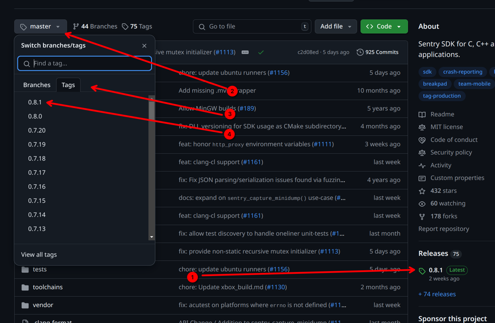

# aui.boot

<!-- aui:index_alias auib_import -->

AUI Boot is yet another package manager based on CMake. If a library uses CMake with
[good CMakeLists](https://github.com/cpm-cmake/CPM.cmake/wiki/Preparing-projects-for-CPM.cmake), AUI Boot in 99% cases
can provide it for you into your project without additional tweaking. It downloads the library, compiles it and places
it in [AUIB_CACHE] folder for future reuse.

## Importing AUI

See [AUI's repository](https://github.com/aui-framework/aui) to check out the import script with the latest version.

```cmake
set(AUI_VERSION v6.2.1) # OLD!

file(
    DOWNLOAD 
    https://raw.githubusercontent.com/aui-framework/aui/${AUI_VERSION}/aui.boot.cmake 
    ${CMAKE_CURRENT_BINARY_DIR}/aui.boot.cmake)
include(${CMAKE_CURRENT_BINARY_DIR}/aui.boot.cmake)
auib_import(
    AUI https://github.com/aui-framework/aui 
    COMPONENTS core views
    VERSION ${AUI_VERSION})

aui_link(YOUR_APP PUBLIC aui::core
                         aui::views)
```

## Prebuilt packages

AUI Boot is a source-first package manager, however, it can pull precompiled packages instead of building them locally.
At the moment, GitHub Releases page with carefully formatted archive names is the only supported option. AUI follows
these rules, so AUI Boot can pull precompiled package of AUI.

To use a precompiled binary, you must specify a tag of a released version from
[releases page](https://github.com/aui-framework/aui/releases) (for example, `v6.2.1` or `v7.0.0-rc.2`). These packages
are self-sufficient, i.e., all AUI's dependencies are packed into them, so it is the only downloadable thing you need to
set up a development and building with AUI.

If you would like to force AUI Boot to use precompiled binaries only, you can set [AUIB_FORCE_PRECOMPILED](AUIB_FORCE_PRECOMPILED):

```shell
cmake .. -DAUIB_FORCE_PRECOMPILED=TRUE
```

This way AUI Boot will raise an error if it can't resolve dependency without compiling it.

If usage of precompiled binaries break your build for whatever reason, you can set [AUIB_NO_PRECOMPILED](AUIB_NO_PRECOMPILED):

```shell
cmake .. -DAUIB_NO_PRECOMPILED=TRUE
```

This way AUI Boot will never try to use precompiled binaries and will try to build then locally.

## CI caching { #CI_CACHING }

No matter using precompiled binaries or building them locally, it's convenient to cache [AUIB_CACHE] in
your CIs:

<!-- aui:snippet .github/workflows/build.yml cache_example -->

This snippet is based on [GitHub's cache action example](https://docs.github.com/en/actions/writing-workflows/choosing-what-your-workflow-does/caching-dependencies-to-speed-up-workflows#example-using-the-cache-action).

GitHub used npm's `package-lock.json` in their example's primary key (`key`). We've adapted their example to AUI Boot
and use `CMakeLists.txt`, as dependencies' versions are "locked" there.

Using a stricter primary key `key` with a bunch of additional keys `restore-keys` is essential. If a cache hit occurs
on the primary key, the cache will not be uploaded back to GitHub cache so your primary key must differ when you
update dependencies.

Don't worry updating dependencies: GitHub `cache` action will restore the cache by using one of
fallback keys `restore-keys` in such case, so you would not lose build speed up. Additionally, since the cache hit
occurred on non-primary key, the newer cache will be uploaded to GitHub so the subsequent builds will reuse it.

## Importing 3rdparty libraries { #AUI_BOOT_3RDPARTY }

For a maintained list of `auib_import`ed libraries, please visit https://github.com/aui-framework/boot.

```
auib_import(Boost https://github.com/boostorg/boost/releases/download/boost-1.84.0/boost-1.84.0.tar.xz
    ARCHIVE
    CMAKE_ARGS -DBOOST_ENABLE_CMAKE=ON
)

aui_link(${PROJECT_NAME} PRIVATE Boost::boost)
```

AUI Framework has a lot of modules and functionality, however, it never pretends to be all-in-one solution for
everything. We value quality over quantity. It is just a basis (framework), where you are free to put whatever building
blocks you want, and we encourage you to do so, particularly, by using 3rdparty libraries. Just don't forget to obey
other projects' licensing conditions, which are, in common, pretty much applicable even for proprietary software.

As was said in the beginning of this page, if a library has a good `CMakeLists.txt` (which mostly true for all popular
C++ libraries), it can be imported with AUI.Boot:

```
# importing Sentry with AUI.Boot
auib_import(sentry https://github.com/getsentry/sentry-native
            VERSION 0.8.1
            CMAKE_ARGS -DSENTRY_BACKEND=crashpad)
aui_link(YOUR_APP PUBLIC sentry::sentry)
```

The first argument to `auib_import` is the library name, which is then passed to CMake's `find_package` in order to
import the library to your project. So, valid library name should be specified. You can obtain the library name from the
following places:

- In common, CMake package matches repository name on GitHub.
- From library's `README`.
- If library name is incorrect, AUI.Boot prints the following message:
  ```
  Make Error at /home/.../.aui/repo/aui/as/0337639/aui/aui.boot.cmake:1019 (message):
  AUI.Boot could not resolve dependency: sentry_bruh

  note: check build logs in
  /home/.../.aui/prefix/sentry_bruh/dd0cfe775cceb4610a5d55b5c257d660

  note: package names are case sensitive

  note: did you mean "sentry"?
  ```

  Take a look on the last line:
  ```
  note: did you mean "sentry"?
  ```
  `sentry` is a valid library name that should have been passed to `auib_import`.

The second argument to `auib_import` is the URL to the library's repository. You can copy&paste it from address bar from
your web browser.

The `VERSION` argument is tag name or hash name. You can copy&paste the latest release version name from GitHub Releases
page of the library *(1)*, or discover their tags *(2,3,4)*:



The optional `CMAKE_ARGS` argument is arguments passed to library's CMake configure, another point of customization by
AUI.Boot. These arguments are library specific; their documentation can be found on library's respective documentation
pages. You won't need to use that unless you want an advanced tinkering of the library.

After library is imported to the project, its *imported target* should be linked to your executable/library. As with
library's name, the name of the imported target probably can be found in library's `README`. Additionally, starting from
CMake version `3.21`, AUI.Boot prints a handy line on configure time when a library is imported:

```
Imported: sentry (sentry::sentry) (/home/.../.aui/prefix/sentry/7542ab4956cac4e96fe399e976906221) (version e1ba734)
```

Here, you can see the imported target(s) name in braces, that one should be used with
`aui_link`/`target_link_libraries`.
The complete library import boilerplate is:

`CMakeLists.txt:`
```
# importing Sentry with AUI.Boot
auib_import(sentry https://github.com/getsentry/sentry-native
            VERSION 0.8.1
            CMAKE_ARGS -DSENTRY_BACKEND=crashpad)
aui_link(YOUR_APP PUBLIC sentry::sentry)
```

`src/main.cpp`:
```cpp
#include <sentry.h>

AUI_ENTRY {
    sentry_options_t *options = sentry_options_new();
    sentry_options_set_dsn(options, "https://YOUR_KEY@oORG_ID.ingest.sentry.io/PROJECT_ID");
    sentry_init(options);

    // your application code …

    sentry_close();
};
```

For more libraries, please visit https://github.com/aui-framework/boot.
### How to fix "Could not resolve dependency" error

Common scenario:

1. Remove [AUIB_CACHE]
2. Remove your build directory

And try again.

### "looks like a config file does not exist for your project"

This means that library's maintainer didn't bother about handling `cmake --install` properly. The best option in
this scenario will be forking the library and append their `CMakeLists.txt` on your own.

You can consult with [Conan Recipes](https://github.com/conan-io/conan-center-index/tree/master/recipes/) or
[Vcpkg Ports](https://github.com/microsoft/vcpkg/tree/master/ports) to see how they have workarounded the broken
`CMakeLists.txt` of the library.

### "did you mean PACKAGE_NAME?"

You have mispelled the package name (the first argument to `auib_import`). Please change the first argument to
`auib_import` to `PACKAGE_NAME`.

### "Imported target ... depends on an out-of-tree file"

The library's maintainer have misused CMake. Follow one of possible options provided by AUI.Boot or fix the
library by forking it. You can consult with
[Conan Recipes](https://github.com/conan-io/conan-center-index/tree/master/recipes/) or
[Vcpkg Ports](https://github.com/microsoft/vcpkg/tree/master/ports) to see how they have workarounded the broken
`CMakeLists.txt` of the library.

### Fixing 3rdparty library's CMakeLists.txt

As was mentioned, AUI.Boot might fail to import a 3rdparty library. Reasons include:

1. Misusage of CMake. Mostly, this applies to CMake's `install` family of commands. Some library maintainers might
   forget to configure CMake so other CMake projects can actually use their library.

   We can't blame them because making proper CMake install export is not an out-of-the-box feature and requires proper
   knowledge with testing. See [this](https://github.com/cpm-cmake/CPM.cmake/wiki/Preparing-projects-for-CPM.cmake) for
   opinionated guidelines.
2. Lack of CMakeLists.txt. Some libraries might not even use CMake either (mostly in favor to Makefile).

For these reasons, you might want to fix the `CMakeLists.txt` on your own by forking them. AUI Project does it for some
of its dependencies:

1. backtrace: implement CMakeLists.txt over Makefile: https://github.com/ianlancetaylor/libbacktrace/compare/master...aui-framework:libbacktrace:master
2. zlib: arbitrary fixes: https://github.com/madler/zlib/compare/master...aui-framework:zlib:master
3. OpenSSL: arbitrary fixes: https://github.com/janbar/openssl-cmake/compare/master...aui-framework:openssl-cmake:master

Also, you can consult with [Conan Recipes](https://github.com/conan-io/conan-center-index/tree/master/recipes/) or
[Vcpkg Ports](https://github.com/microsoft/vcpkg/tree/master/ports) to see how they have workaround the broken
`CMakeLists.txt` of the library.

## Using AUI Boot without AUI

AUI Boot does not have any hard dependencies on AUI, so it can be used to manage dependencies on non-AUI projects.

```cmake
set(AUI_VERSION v6.2.1)

file(
    DOWNLOAD 
    https://raw.githubusercontent.com/aui-framework/aui/${AUI_VERSION}/aui.boot.cmake 
    ${CMAKE_CURRENT_BINARY_DIR}/aui.boot.cmake)
include(${CMAKE_CURRENT_BINARY_DIR}/aui.boot.cmake)
```
<!-- aui:snippet aui.core/CMakeLists.txt auib_import_examples -->
```cmake
target_link_libraries(YOUR_APP PUBLIC fmt::fmt-header-only range-v3::range-v3)
```

## Importing project as a subdirectory

See [AUIB_ADD_SUBDIRECTORY]

## CMake commands

### auib_import

If needed, downloads and compiles project. Adds an `IMPORTED` target. Built on top of `find_package`.

#### Signature
```cmake
auib_import(<PackageName> <URL>
            [ADD_SUBDIRECTORY]
            [ARCHIVE]
            [COMPONENTS components...]
            [CONFIG_ONLY]
            [CMAKE_WORKING_DIR workingdir.txt]
            [PRECOMPILED_URL_PREFIX <PrecompiledUrlPrefix>]
            [LINK <STATIC|SHARED>]
            [REQUIRES dependencies...]
            [VERSION version])
```

!!! note
    
    This command copies `*.dll`, `*.so` and `*.dylib` (in case of shared libraries) alongside your executables during
    configure time. See [runtime-dependency-resolution.md] for more info.

#### PackageName
Specifies the package name which will be passed to `find_package`. See [AUI_BOOT_3RDPARTY].

#### URL
URL to the git repository of the project you want to import.

#### ADD_SUBDIRECTORY { #AUIB_ADD_SUBDIRECTORY }

See also: [AUIB_LIB_AS].

Uses `add_subdirectory` instead of `find_package` as the project importing mechanism. 

Potential use case of this is when the dependency fails to provide proper CMake install, making `find_package` unusable.
If you don't care about polluting your own build tree with dependency's targets - it is a good alternative to fixing
their CMake install on your own, which is a challenging task.

This action disables usage of precompiled binary and validation.

#### ARCHIVE

The provided URL is pointing to zip archive instead of a git repository.

For large dependencies, this might be faster than pulling whole repository.

#### CONFIG_ONLY

Forces `find_package` to use the config mode only.


#### VERSION
Commit hash, tag or branch name to `checkout`.

When no version is specified, AUI.Boot defaults to using the latest version from the main branch. Once AUI.Boot
discovers and locks onto a version, **it will never automatically update that version**, even across rebuilds. If you
specify a branch name in the `VERSION` parameter instead of a specific tag or commit, the same semantics take place.

Branch names point to moving targets - the same branch name could reference different commits at different times. Using
a specific tag or hash ensures you get exactly the same code every time you build.

AUI.Boot will emit a warning encouraging the use of either:

- Tags (e.g. `v1.2.3`) - ideal for released versions
- Commit hashes (e.g. `8b0e838b`) - perfect for specific commits or work-in-progress changes

!!! note

    Despite this argument is optional, we still encourage you to use it, to "lock" the version. This makes your builds
    precisely reproducible on other machines.

#### COMPONENTS
List of components to import which will be passed to `find_package`. Also, passed as semicolon-separated list to
dependency's `CMakeLists.txt` via `AUIB_COMPONENTS` variable.

#### CMAKE_WORKING_DIR
Run cmake in specified directory, in relation to the pulled repo's root directory.

#### PRECOMPILED_URL_PREFIX
Instead of building the dependency from sources, try to import the precompiled binaries first.

#### LINK

Overrides `BUILD_SHARED_LIBS` of the dependency, specifying `SHARED` or `STATIC` linking.

#### REQUIRES

List of the package dependencies. Every dependency's root variable (${DEPENDENCY}_ROOT) is checked for existence and
validness, then it passed directly to `auib_import`ed target (via ${DEPENDENCY}_ROOT).

It is useful when some package root is implicitly defined in your project somewhere and aui.boot does not know about it,
thus does not forward.

## Variables

See [aui-configure-flags.md] on how to set variables.

### AUIB_ALL_AS (=FALSE|TRUE)

Equivalent of setting [AUIB_LIB_AS] for every single library present in the project.

### AUIB_<PackageName>_AS (=FALSE|TRUE)

Uses `add_subdirectory` instead of `find_package` as the project importing mechanism. This means that the library
becomes a part of your project, within your `build/` directory. This allows changing the library's code seamlessly.

It is useful for library developers. They can use consumer's project to change something in their library, without
changing `CMakeLists.txt` of the consumer's project. Setting `AUIB_<PackageName>_AS` is an equivalent of passing
[AUIB_ADD_SUBDIRECTORY] to `auib_import`.

This action disables usage of precompiled binary and validation.

Usage:

```
cd build
cmake .. -DAUIB_LIB_AS=ON
```
Where 'LIB' is library project name. For example, to import AUI as a subdirectory:

```
cd build
cmake .. -DAUIB_AUI_AS=ON
```

You can switch `AUIB_AUI_AS` on an existing build tree, AUI.Boot is capable of switching on-the-fly.

During the execution of the command above, the location of the LIB is printed:

```
Imported: aui () (/home/user/.aui/repo/aui/as/v8.0.0-rc.1/aui) (version v8.0.0-rc.1)
```

Which points to the LIB's source tree used to build the consumer's project. You can change anything in that
directory as part of your development workflow, and these changes will reflect immediately on the consumer's
project.

Your changes will not be overridden by further CMake invocations.

You can `cd` and commit changes right from that directory as you complete your work on the library:

```bash
cd /home/user/.aui/repo/aui/as/v8.0.0-rc.1/aui
# don't forget to checkout, we are in detached HEAD state
git checkout -b feat/a-new-feature
git commit -m "a new feature"
git remote set-url origin git@github.com/your-name/your-aui-fork
git push
```

!!! note

    To have write access to the library's repository, it's likely you'll need to make a fork. Optionally, you can
    upstream your changes in the future.

Since you have updated the library, you may want to share your own version of the library within your project. To do
this, you need to:

1. Acquire the **commit hash**:
    ```bash
    /home/user/.aui/repo/aui/as/v8.0.0-rc.1/aui $ git log
    commit 8b0e838b8cd6274210f4c05ac096e2862c36f25e (HEAD -> feat/a-new-feature, origin/feat/a-new-feature)
    Author: smol boi <uwu@uwu.uwu>
    Date:   Sun Jun 1 21:49:31 2025 +0300

        Never Gonna Give You Up
    ...
    ```
2. In your `CMakeLists.txt`, make sure the **URL** points to your fork, if any:
    ```cmake
    auib_import(aui https://github.com/your-name/your-aui-fork
                VERSION v7.0.0
    )
    ```
3. Specify **commit hash** in `VERSION` field:
    ```cmake
    auib_import(aui https://github.com/your-name/your-aui-fork
                VERSION 8b0e838b8cd6274210f4c05ac096e2862c36f25e
    )
    ```
4. Commit and push to your project

!!! note

    It is common to delete a feature branch after merging. Be careful: AUI.Boot can't find a commit if it was deleted
    from a repository.


### AUIB_DISABLE (=FALSE|TRUE) { #AUIB_ADD_SUBDIRECTORY }

Disables aui.boot. All calls to `auib_import` are forwarded to `find_package`.

### AUIB_SKIP_REPOSITORY_WAIT (=FALSE|TRUE)

Disables "Waiting for repository" [lock](REPO_LOCK).

### AUIB_NO_PRECOMPILED (=FALSE|TRUE)  { #AUIB_NO_PRECOMPILED }

Disables precompiled binaries, building all dependencies locally. You may want to set up [CI_CACHING].

### AUIB_FORCE_PRECOMPILED (=FALSE|TRUE)  { #AUIB_FORCE_PRECOMPILED }

Disables local compilation. If a precompiled binary was not found, a configure-time error is raised.

### AUIB_PRODUCED_PACKAGES_SELF_SUFFICIENT (=FALSE|TRUE)

The `AUIB_PRODUCED_PACKAGES_SELF_SUFFICIENT` flag can be used to enable self-sufficiency of packages produced with AUI
Boot. This means that the dependencies required for building these packages are included in the package (`tar.gz`)
archive in the `deps/` dir.

See [aui_boot_producing_packages]

### AUIB_VALIDATION_LEVEL

Applies a set of checks on each *dependency* pulled by AUI.Boot. These checks verify that the *dependency* follows
so-called [modern CMake practices](https://github.com/cpm-cmake/CPM.cmake/wiki/Preparing-projects-for-CPM.cmake).
Raising this value may help to localize some errors related to the dependency in your build system that would have
appeared somewhere in the future unexpectedly.

It is a forced measure due to lack of proper CMake usage.

All AUI's dependencies are marked with the highest validation level.

Defaults to `1`.

#### AUIB_VALIDATION_LEVEL 0

All checks are disabled.

#### AUIB_VALIDATION_LEVEL 1

*Covers scenario*: `cmake --install .` of *dependency* produces a valid local CMake package installation.

*Requirements*:

1. *Dependency*'s installation in directory `A` can be produced with `cmake --install . --prefix=A`. A `find_package`
   call with dependency's name is capable of importing the *dependency*'s into the *consumer*'s build system.
2. Targets created as a result of calling `find_package` on the *dependency* can and should define properties so the
   *consumer* can actually use the functionality provided by the *dependency*. If such property refer to a local file,
   this file must be located in AUI.Boot's cache dir (`~/aui`). In case of *dependency*'s dependencies (aka grand
   dependencies), those be imported by a prior `auib_import`.
   ```cmake
   auib_import(ZLIB https://github.com/aui-framework/zlib)
   auib_import(Freetype https://github.com/freetype/freetype
               CONFIG_ONLY
               CMAKE_ARGS ...
   )
   # Freetype depends on ZLIB, must refer to one located in
   # ~/.aui/prefix/zlib/.../libz.a, not the system one: /usr/libz.so
   ```

   As an exception, a system file can be mentioned via CMake target. System packages must be wrapped with
   `auib_use_system_libs_begin`/`auib_use_system_libs_end` in such scenario.
   @dontinclude aui.views/CMakeLists.txt
   @skip auib_use
   @until auib_use_system_libs_end

#### AUIB_VALIDATION_LEVEL 2

*Covers scenario*: `cmake --install .` of *dependency* produces a [relocatable binary package](PREBUILT_PACKAGES).

*Requirements*:

1. Implies `VALIDATION_LEVEL 1`.
2. Targets and variables created as a result of calling `find_package` on the *dependency* cannot contain absolute
   paths, with an exception to commonly available system files.
3. If a target depend on another library, it should express it by referring on exported target of that library instead
   of referring to its file.

   ```cmake
   target_link_libraries(awesomelib PUBLIC ${ZLIB_LIBRARIES}) # WRONG!
   target_link_libraries(awesomelib PUBLIC ZLIB::ZLIB) # GOOD!
   ```

   !!! note
       
       AUI.Boot is capable of replacing absolute paths to libraries by their respective target names in order to support
       legacy libraries.


## Diamond Shape Graphs
### Case 1

For example, your application uses `aui.core` module, which actually uses `ZLIB`:


When you also want to use `ZLIB`.

**Without AUI.Boot**, you'd place (and compile) another copy of `ZLIB` whose version may differ from `ZLIB` that `aui.core` uses, causing you to stuck with dependency hell:


**With AUI.Boot**, you'd not even use AUI.Boot's functions! Just use `find_package(ZLIB REQUIRED)` and link it to your application with `target_link_libraries(YourApplication PRIVATE ZLIB::ZLIB)`, because AUI.Boot forwards location of used dependencies to your project. Your application and AUI are using the same `ZLIB`:


### Case 2

Another case is `OpenSSL` between `aui.crypt` and `aui.curl`:


Because `libcurl` is not a part of AUI, it uses standard CMake's function to find `OpenSSL` (`find_package`).

## Producing packages with dependencies managed by AUI Boot

AUI distributions [published on our GitHub releases page](https://github.com/aui-framework/aui/releases) are produced with help of AUI Boot.

CMake-driven projects produce package configuration with [configure_file](https://cmake.org/cmake/help/latest/command/configure_file.html):

<!-- aui:snippet CMakeLists.txt configure_file_example -->

Inside of `aui-config.cmake.in`, there's a line:
```cmake
@AUIB_DEPS@
```

`AUIB_DEPS` contains cmake commands to resolve dependencies of your project. This variable is populated by `auib_import`
calls inside your project during configure time. `AUIB_DEPS` contains `auib_import` calls.

As was mentioned, AUI Boot requires specially formatted (precompiled) package names to use them. For this to work, you
can call `auib_precompiled_binary` inside of your root `CMakeLists.txt` which configures `cpack` to produce `tar.gz`
with properly formatted name.

<!-- aui:snippet CMakeLists.txt auib_precompiled_binary -->

At last, use `cpack` to produce a package.

<!-- aui:snippet .github/workflows/build.yml cpack -->

## Importing AUI without AUI Boot

In some cases, AUI Boot might not cover your particular needs, and you would like to build without it. It is still not
a recommended way of using AUI, as it is not fully covered with tests, and you're basically trying to complicate your
life by hardcoding paths in your CMake lists and thus making hardly reproducible projects. Consider
[asking questions](https://github.com/aui-framework/aui/issues) about AUI Boot on our GitHub page, and we'd help to adapt AUI Boot to your use case.

### Building AUI without AUI Boot

[AUIB_DISABLE] CMake configure flag can be used to replace `auib_import` calls to `find_package`. In this scenario
you will need to resolve AUI's dependencies in some other way (i.e, by using Conan).

### Using AUI distributions with `find_package`

AUI distributions [published on our GitHub releases page](https://github.com/aui-framework/aui/releases) are
self-sufficient. That is, they have AUI's dependencies bundled, so they can be used by `find_package`, without even
requiring AUI Boot.

<!-- aui:include test/aui.boot/Precompiled3/test_project/CMakeLists.txt -->

## ~/.aui (AUI.Boot Cache Dir) { #AUIB_CACHE }

It is a directory located in your home directory (can be changed with [AUIB_CACHE_DIR]). This
directory contains dependencies' source code and installation artifacts of each dependency. AUI.Boot looks up there
for built libraries or their source code in order to reduce build latency and bandwidth.

If a dependency is not present in the cache, AUI.Boot will download a precompiled binary or build it from source, so the
subsequent `auib_import` invocations can reuse that even across different projects.

On a CI/CD, you can [cache](#CI_CACHING) this directory to drastically improve build times.

## Structure

### ~/.aui/prefix

Contains dependencies produced by `cmake -B build -S .`, `cmake --build build` and
`cmake --install build --prefix=~/.aui/prefix/../` series of commands, potentially invoked inside `auib_import`.

Dependency installations are located in following path: `~/.aui/prefix/<PackageName>/<BUILD_SPECIFIER>`.

`<BUILD_SPECIFIER>` is a special hex string that identifies the build configuration, similarly to Conan's
[package_id](https://docs.conan.io/2/reference/binary_model/package_id.html). `<BUILD_SPECIFIER>` is a hashed string
that includes information such as version, platform, architecture, or being a static or a shared library. When something
changes in this information, it produces a new `<BUILD_SPECIFIER>` because it represents a different binary.

Here's how exactly it is computed:

<!-- aui:snippet aui.boot.cmake BUILD_SPECIFIER -->

### ~/.aui/repo

Contains dependencies source code (if any), downloaded by `auib_import`.

- `~/.aui/repo/<PackageName>/src` - source code of `<PackageName>`. If it is a git repository, AUI.Boot will try to
  checkout a specific version first instead of cloning the whole repo again.
- `~/.aui/repo/<PackageName>/src/FETCHED` - indicates the latest download is successful.
- `~/.aui/repo/<PackageName>/build` - `<PackageName>` build directory. Cleaned up after a successful installation.

If the dependency imported as a [subdirectory](AUIB_ADD_SUBDIRECTORY), these paths are used instead:

- `~/.aui/repo/<PackageName>/as/<VERSION>/<PackageName>` - a copy of source to be used by CMake's `add_subdirectory`.
  The second `<PackageName>` helps IDEs such as CLion to identify dependency name.
- `~/.aui/repo/<PackageName>/as/<VERSION>/<PackageName>/FETCHED` - indicates the latest download is successful.
- `~/.aui/repo/<PackageName>/as/<VERSION>/build` - build directory.

### ~/.aui/crosscompile-host

In case of [crosscompiling.md], contains AUI.Boot sub cache for the host system.

### ~/.aui/repo.lock

Lock file of `auib_import` to forbid multiple parallel processes to modify `auib_import`.

## Philosophy behind AUI Boot

AUI Boot follows AUI Project philosophy, i.e, simplify developers' life and improve experience as far as possible. We
were needed a CMake-only solution, so we skipped external generators (i.e., those that introduce additional building
layer over CMake).

Despite CMake itself is complex (spoiler: every build system is) but thanks to the complexity **CMake actually does the
job good enough** and its scripting system thankfully allows to download files from internet (and not only that).

Introducing additional building layer literally multiplies the building complexity by two. Moreover, Android targets
already introduce such a layer (called Gradle). For example, if we were using [Conan](https://conan.io/), Android
building process would have 4 layers: Gradle, CMake, Conan, CMake (yes, 2 CMake layers).

AUI Boot (and [CPM](https://github.com/cpm-cmake/CPM.cmake)) require CMake only and don't involve extra runtime. Build
should be easily reproducible, i.e., invocation of CMake (`cmake -S . -B build`) is sufficient to set up a dev
environment. No additional tinkering (i.e, downloading and installing external tools or libraries, passing them to
the build) is required, with an exception to application's domain (for example, auth/API keys).

That being said, let's overview alternatives:

- [CPM](https://github.com/cpm-cmake/CPM.cmake) (CMake's missing package manager) - almost perfectly suits our needs but
  lacks precompiled packages support which renders painful to some of our users.
- [vcpkg](https://github.com/microsoft/vcpkg) - external and maintained by Microsoft. Requires additional setup and
  overwriting `CMAKE_TOOLCHAIN_FILE`. In case of Android, additional tinkering with Gradle script is required.
- [conan](https://conan.io/) - external, requires Python runtime and knowledge. Using Conan leads to 3 browser tabs
  always opened: Python docs, Conan docs and CMake docs. In case of Android, additional tinkering with Gradle script is
  required. Pushes Artifactory which is a paid self-hosted solution but thanks to that offers free large repository of
  precompiled packages. Conan is slowly becoming a de facto standard for C++ so we're looking forward for adding conan
  support (without dropping AUI Boot).
- CMake's FindPackage/FetchContent/ExternalProject - limited, involve a lot of boilerplate, can't be tweaked from
  configure-time variables, lack precompiled binaries.

AUI is a C++ project, thus it should use CMake for AUI itself and AUI-based applications. Configure? `cmake ..`. Build?
`cmake --build .`. Test? `ctest .`. Package? `cpack .`. CMake offers enough functionality for various use cases. Let's
avoid creating an uncomfortable situation by involving snakes in the process of developing C++ applications, we have
our own great tools already.
