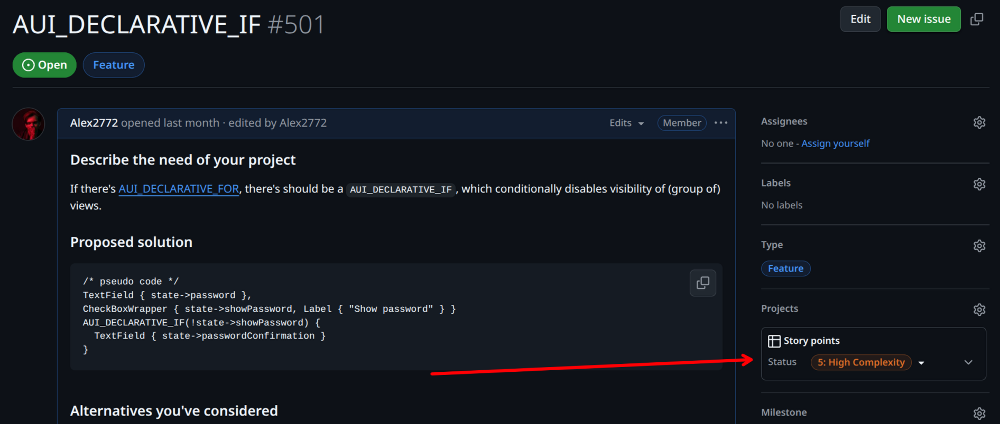
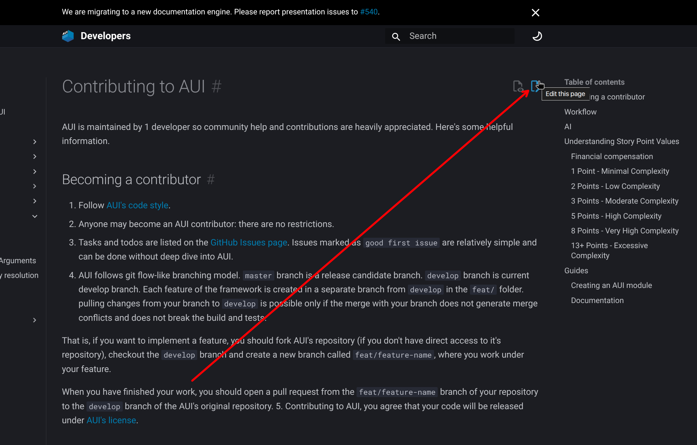

# Contributing to AUI

AUI is maintained by 1 developer so community help and contributions are heavily appreciated. Here's some helpful
information.

## Becoming a contributor

1. Follow [AUI's code style](code-style.md).
2. Anyone may become an AUI contributor: there are no restrictions.
3. Tasks and todos are listed on the [GitHub Issues page](https://github.com/aui-framework/aui/issues). Issues marked
   as `good first issue` are relatively simple and can be done without deep dive into AUI.
4. AUI follows git flow-like branching model. `master` branch is a release candidate branch. `develop` branch is current
   develop branch. Each feature of the framework is created in a separate branch from `develop` in the `feat/` folder.
   pulling changes from your branch to `develop` is possible only if the merge with your branch does not generate merge
   conflicts and does not break the build and tests.

   That is, if you want to implement a feature, you should fork AUI's repository (if you don't have direct access to
   it's repository), checkout the `develop` branch and create a new branch called `feat/feature-name`, where you work
   under your feature.

   When you have finished your work, you should open a pull request from the `feat/feature-name` branch of your
   repository to the `develop` branch of the AUI's original repository.
5. Contributing to AUI, you agree that your code will be released under
   [AUI's license](https://github.com/aui-framework/aui/blob/master/LICENSE).

## Workflow

`master` branch contains code of the release candidate. Code of this branch must compile without errors and should pass
all tests on all supported platforms.
Each feature of the framework is created in a separate branch in the `feat/` folder. Pulling changes from your branch to
`master` is possible only if the merge with your branch does not generate merge conflicts and does not break the build
and tests.

Merges from `feat/` branch are allowed only to `develop` branch. `develop` is the branch were our actual development
work happens. When we consider `develop` branch stable enough, we merge `develop` and `master` and create a release.

If you are an external developer (i.e., have no write access to AUI's repository), you will need to create a fork of AUI
and commit to it. Whilst you can commit to `master` and `develop` branches of your own repository, we still recommend to
follow feature branch workflow. After you finished your work in your feature branch, open pull request from your feature
branch to AUI's `develop` branch.

## AI

We'd happily accept your AI-assisted work, as soon as you take complete responsibility thereof, and you have complete
understanding of the changes you propose. Make sure your AI-assisted work does not violate someone's copyright. Please
manually review and adjust AI-generated code/documentation. We won't merge changes if they contain obvious AI traces:

- hallucinations
- AI assistant-specific unnecessary statements: "I'm happy to help", "Please let me know if you have questions", etc
- overexplanation, repetitive points, fluff writing
- excessive usage of bullet points: nobody writes a page filled with bullet points entirely but AI

Please treat AI as a tool, not as a complete replacement of a software engineer.

## Understanding Story Point Values

Story points are designed as relative measurements of work complexity, deliberately decoupled from time-based metrics (
hours/days/weeks). They provide a general indication of effort required for task completion. It's important to note that
story point comparisons across different teams, departments, or organizations are inherently invalid.



For example, Team A's 100-point sprint delivery might represent more actual work than Team B's 200 points, as each team
develops their own story point scale. While this guide isn't meant to standardize story points globally, it offers
internal guidelines for consistent estimation.

Note: All stories include standard overhead for PR reviews, test verification, and deployment processes. This overhead
should be factored into estimates and can sometimes exceed the time needed for the primary task.

This section explains how story points are assigned to tasks in the AUI framework project and their relationship to
developer compensation.

### Financial compensation

The number of story points assigned to a GitHub issue in the AUI repository directly determines the financial
compensation paid to the external developer who successfully resolves that issue.

For information about getting in touch regarding compensation, please refer to the contact details provided in
our [README](https://github.com/aui-framework/aui/blob/master/README.md). Pick
[a task](https://github.com/orgs/aui-framework/projects/4/views/1) which you want to
resolve before contacting.

### 1 Point - Minimal Complexity

These represent the simplest possible changes. They involve single-line or minimal code modifications, such as text
corrections or content updates. Tasks typically involve simple configuration value modifications with no logic
alterations or risk of breakage. There are no external dependencies, and all necessary information is self-contained
within the ticket. The changes are covered by existing tests or basic smoke testing, with no test updates required.

### 2 Points - Low Complexity

These tasks represent approximately double the effort of a 1-point story. They may include minor third-party dependency
updates with API adjustments and basic method refactoring without output changes. New test creation might be necessary.
External dependencies are straightforward, such as Docker image whitelisting, and follow clear documentation or known
processes.

### 3 Points - Moderate Complexity

This is the first level where significant uncertainty enters the picture. These tasks require a notable but manageable
time investment and may involve multiple external dependencies. They often include major version updates of libraries
with breaking changes. Some cross-team communication is required, though clarifications can typically be resolved
through a single call or chat. This represents the upper range of typical story size.

### 5 Points - High Complexity

These stories are an extended version of 3-point complexity, involving a substantial workload with multiple unknowns to
resolve. They often include significant breaking changes across components and require extensive test modifications.
Multiple cross-team meetings are likely necessary, and broader stakeholder involvement is common.

### 8 Points - Very High Complexity

This represents the maximum reasonable scope for a single sprint. These stories involve major system changes or
refactoring, new integrations, or complete rewrites. They come with significant unknowns at the start and should be
considered for splitting into smaller stories. Examples include framework migrations or major library updates.
Requirements often have high uncertainty.

### 13+ Points - Excessive Complexity

Stories of this size exceed single sprint capacity and typically require multiple sprints to complete. They contain too
many unknowns and variables, carrying a high risk of underestimation. Such stories should be split into smaller
components or converted to epics. Examples include full API integrations or complete rebranding projects. These
large-scale changes are too complex to estimate accurately and manage effectively within a single sprint.

## Guides

### Creating an AUI module

Suppose whe want to create a module called `aui::my_module`:

1. In the main `CMakeLists.txt`:
    1. Find the `# define all components` anchor, put `define_aui_component(my_module)`.
    2. Find the `# all components for exporting` anchor, put `my_module` to `AUI_ALL_COMPONENTS`.
2. If `aui::my_module` has external dependencies, handle them at `# add dependencies` in
   `cmake/aui-config.cmake.in`.
3. Put the reference to the module in `docs/index.md`.
4. Create `aui.my_module` dir.
5. Copy & paste `CMakeLists.txt` from any small module (i.e. `aui::xml`) and configure it for your module.
6. Use `API_AUI_<your module>` to export symbols from your module (it's created by the `aui_module` CMake function).

### Documentation

!!! tip "Recommended: easy way to contribute"

    Want to fix a typo or make a small documentation improvement? You can do it directly through GitHub:
    
    1. Navigate to top right corner of the page you would like to contribute to and click "Edit this page".
       
    2. On GitHub's edit page, you'll be prompted to fork the AUI repository if needed
    3. Make your changes in the editor.
    4. Commit your changes and create a pull request to https://github.com/aui-framework/aui
    5. Once our documentation pipelines verify the changes, we'll merge your contribution.

    This process is perfect for minor documentation updates and doesn't require setting up a local development
    environment.


The docs found on [aui-framework.github.io](https://aui-framework.github.io) is generated with MkDocs.

To generate documentation, run the following command from the root of AUI repository:

!!! note
    
    These commands are not tested on Windows.

```bash
git clone https://github.com/aui-framework/aui
cd aui
git checkout develop # we do development on develop branch only

# if you want to use venv
python3 -m venv .venv
source .venv/bin/activate

# only for the first time
python3 -m pip install -r docs/python/requirements.txt 

# generate docs
mkdocs serve --use-directory-urls
```

After the command is complete, you can visit docs at [http://127.0.0.1:8000/](http://127.0.0.1:8000/).

In our pipelines, we use `--strict` flag to treat warnings as errors. If warnings were produced during generation, the
CI/CD pipeline wouldn't pass.

```bash
mkdocs build --strict --use-directory-urls
```

Most functionality is provided by Material for MkDocs theme. In addition to `md` files found in `docs/` dir, we have
several python scripts to populate documentation:

 - `docs/python/hooks.py` - handles XML comments.
 - `docs/python/doxygen.py` - handles Doxygen-style documentation found in our C++ code. Doxygen, as the tool, does not
   participate in our documentation generation. We still use Doxygen style to maintain compatibility with documentation
   readers in IDEs.
 - `docs/python/examples_page.py` - generates pages related to examples.
