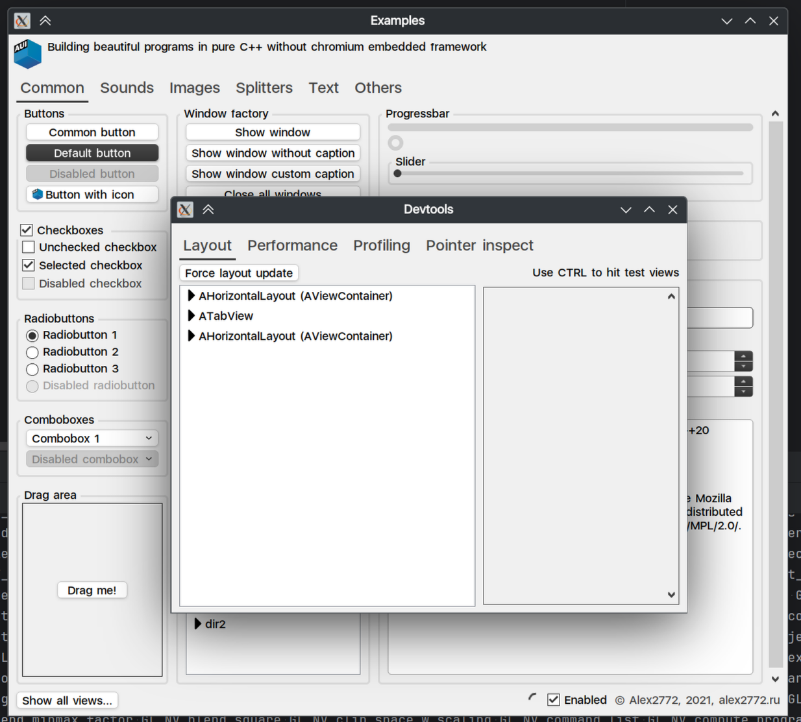

# Devtools

Devtools is a UI set of tools integrated in `aui.views` and thus in every AUI application. The devtools window can be
invoked by hitting `CTRL+F12` on AUI-based application (debug only).

## Layout tab

The most notable functionality of devtools is the `Layout` tab. Here you can discover your view hierarchy and check
which [ASS](ass.md) rules were applied to your view.

You can hold `CTRL` and hover over your application to peek views:

