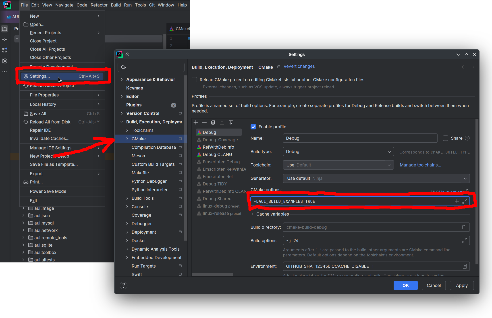
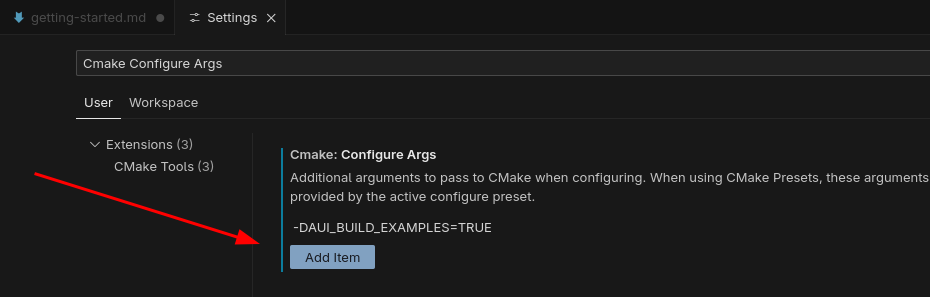

# Examples

This document lists a collection of code samples and tutorials designed to help both newcomers and experienced
developers with AUI Framework app development. These projects cover diversity of topics, from fundamental views usage
through to complete application assembly.

## Building the Examples

To build these examples, simply clone [AUI repository](https://github.com/aui-framework/aui) and configure CMake with
`-DAUI_BUILD_EXAMPLES=TRUE`.

=== ":simple-clion: CLion"

     1. Open Settings: ++ctrl+alt+s++.
     2. Go to `Build, Execution, Deployment` > `CMake`.
     3. Add `-DAUI_BUILD_EXAMPLES=TRUE` to `CMake options`.
    
    

=== ":material-microsoft-visual-studio-code: VS Code"

    1. Open Settings: ++ctrl+comma++.
    2. Search for `CMake Configure Args`.
    3. Press button `Add item`
    4. Enter `-DAUI_BUILD_EXAMPLES=TRUE`.
       
    


=== ":octicons-terminal-16: Terminal"

    ```bash
    git clone https://github.com/aui-framework/aui
    cd aui
    mkdir build
    cd build
    cmake .. -DAUI_BUILD_EXAMPLES=TRUE -GNinja
    cmake --build . --parallel
    cd bin

    # launch any program
    ./aui.example.views
    ```

Some of these examples are located outside <!-- aui:example-file-count 0 --> AUI's build tree; such examples should be
compiled as regular CMake projects.

## App

These examples typically go beyond single-file projects and delve into more substantial applications that showcase how
multiple techniques can be integrated to create nearly production-ready applications. Each example not only demonstrates
specific features of the AUI Framework but also covers practical aspects such as dependency management, data binding and
user interface customization.

{}

## UI

Various UI building samples.

{}

## Desktop

Desktop-specific examples.

{}

## 7GUIs

[7GUIs](https://7guis.github.io/7guis/) is a GUI toolkit benchmark that defines seven tasks representing typical
challenges in GUI programming. In addition, 7GUIs provide a recommended set of evaluation dimensions. As such,
implementations of these tasks can be compared side by side. AUI project provides its own implementations.

{}
