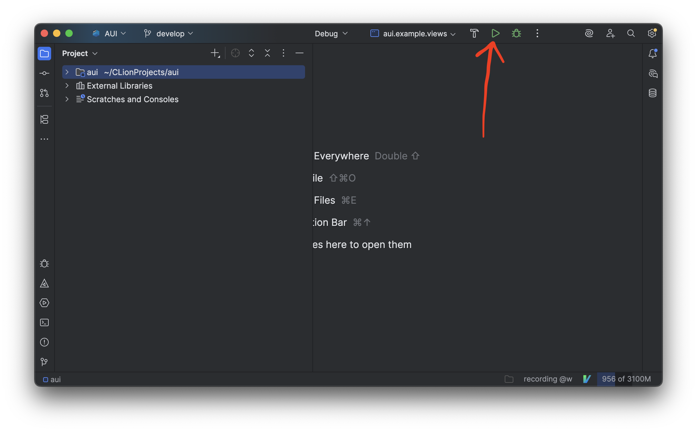
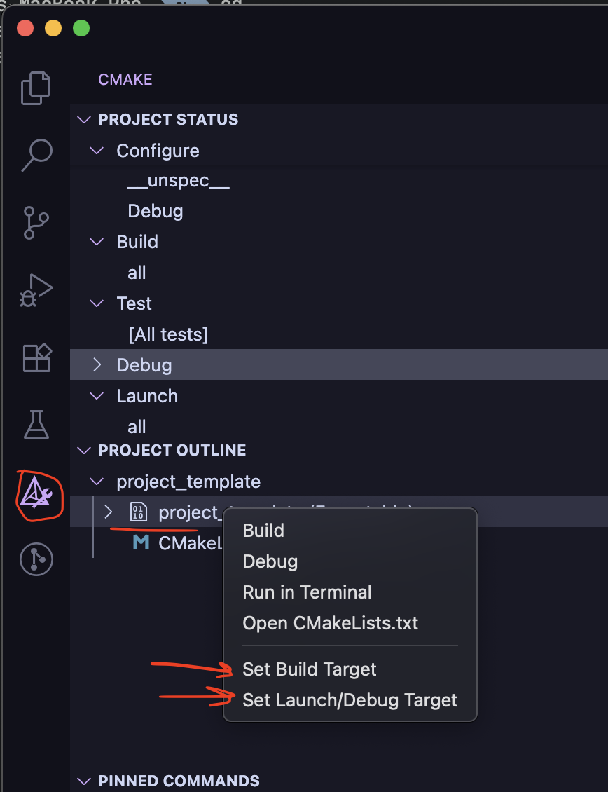
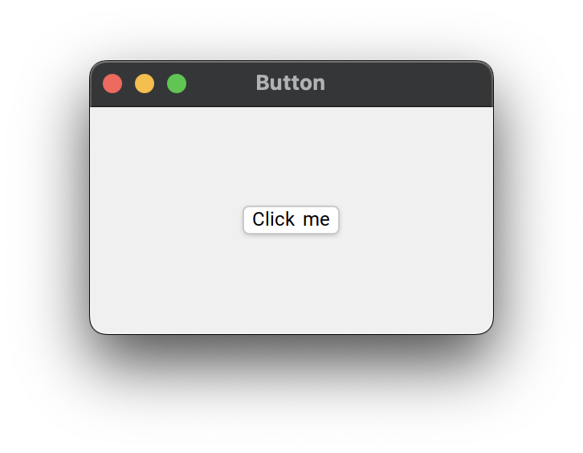

# Getting started with AUI

## IDE

=== ":simple-clion: CLion"
    
    - **Recommended** as "out of the box" crossplatform solution.
    - Has free version for non-commercial development.
    - No additional setup required.
    
=== ":material-microsoft-visual-studio-code: VS Code"
    
    Install following extensions:
    
    | Extension                                                                                                  | Description                                                           |
    | ---------------------------------------------------------------------------------------------------------- | --------------------------------------------------------------------- |
    | [cpp tools pack](https://marketplace.visualstudio.com/items?itemName=ms-vscode.cpptools-extension-pack)    | Introduces basic C/C++ support and CMake integration.                 |
    | [vscode-clangd](https://marketplace.visualstudio.com/items?itemName=llvm-vs-code-extensions.vscode-clangd) | C++ language server for extensive code navigation, autocomplete, etc. |

## Installation

AUI does not provide "traditional" installation methods that involve manual downloading and deploying; instead, package
managers are used to ensure easily reproducible builds. They compile and link all required dependencies automatically
to free you from dependency management and focus you right to development of your application.

=== "AUI App Template"
    
    You can use our [app-template] to set up a new project quickly with [CLANG_FORMAT], Github Actions and other
    features out-of-the-box. The template is based on CMake and [aui.boot].
    
    Clone `https://github.com/aui-framework/example_app` with your IDE or via terminal:
    
    ```bash
    git clone https://github.com/aui-framework/example_app
    ```
    
    and open that directory in your IDE.

=== "Manual Setup"
    
    AUI provides support to several package managers, to choose at your own.

    === "AUI Boot"
        
        [aui.boot] is \*official\* way of using AUI. It is a CMake-based package manager that requires nothing but CMake.
        
        ```cmake title="CMakeLists.txt"
        # Standard routine
        cmake_minimum_required(VERSION 3.16)
        project(project_template)
        
        # Use AUI.Boot
        file(
            DOWNLOAD 
            https://raw.githubusercontent.com/aui-framework/aui/master/aui.boot.cmake 
            ${CMAKE_CURRENT_BINARY_DIR}/aui.boot.cmake)
        include(${CMAKE_CURRENT_BINARY_DIR}/aui.boot.cmake)
        
        # import AUI
        auib_import(
            aui https://github.com/aui-framework/aui 
            COMPONENTS core views
            VERSION v7.1.2
            )
        
        
        # Create the executable. This function automatically links all sources from the src/ folder, creates CMake target and
        # places the resulting executable to bin/ folder.
        aui_executable(project_template)
        
        # Link required libs
        aui_link(project_template PRIVATE aui::core aui::views)
        ```
    
    === "CPM"
        
        [CMake's missing package manager](https://github.com/cpm-cmake/CPM.cmake) is a small CMake script for
        setup-free, cross-platform, reproducible dependency management.
        
        Download CPM to your project directory:
        
        ```bash
        mkdir -p cmake
        wget -O cmake/CPM.cmake https://github.com/cpm-cmake/CPM.cmake/releases/latest/download/get_cpm.cmake
        ```

        Then, create a `CMakeLists.txt`:
        
        ```cmake title="CMakeLists.txt"
        # Standard routine
        cmake_minimum_required(VERSION 3.16)
        project(project_template)
        
        # import AUI
        include(cmake/CPM.cmake)
        CPMAddPackage("gh:aui-framework/aui#v7.1.2")
        
        # Create the executable. This function automatically links all sources from the src/ folder, creates CMake target and
        # places the resulting executable to bin/ folder.
        aui_executable(project_template)
        
        # Link required libs
        aui_link(project_template PRIVATE aui::core aui::views)
        ```
    
    [aui_executable] hooks all CPP files from `src/` directory. You need to create `src/` directory and a CPP file in
    it.
    
    <!-- aui:include examples/ui/button/src/main.cpp title="src/main.cpp" -->


!!! note "In case CMake or IDE don't recognize a new CPP file"
    
    [Reload](troubleshoot-list.md#BUILD_CACHE_INVALIDATION) CMake project to hook up a newly added CPP file:

    === ":simple-clion: CLion"
        
        `File` > `Reload CMake Project` or right-click on `CMakeLists.txt` > `Load/Reload CMake project`.

    === ":material-microsoft-visual-studio-code: VS Code"
        
        ++f1++ `>CMake: Configure`. If it asks for a toolchain, choose `Unspecified`.

    === ":octicons-terminal-16: Terminal"

        ```bash
        cmake -S . -B build
        ```

## Build and Run Your App

=== ":simple-clion: CLion"
  
    `Run` -> `Run "project name"` or green arrow in top right corner.
    

=== ":material-microsoft-visual-studio-code: VS Code"
  
    1. ++f1++ `>CMake: Configure`.
    2. Choose CMake logo in the left panel (where the extensions tab live).
    3. Right click on project's target > `Set Build target` and `Set Launch/Debug target`.
       
    4. ++f1++ `>CMake: Debug`.

=== ":octicons-terminal-16: Terminal"

    ```bash
    cmake -S . -B build
    cmake --build build
    ```



See [layout managers](layout-managers.md) for more info about layout managers.

See [ASS](ass.md) for more info about styling.

See [examples] for examples.
