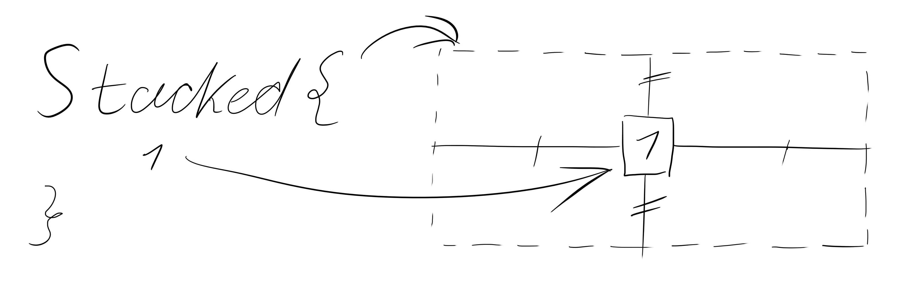
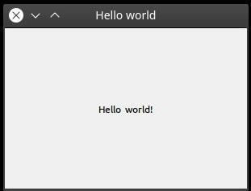

# Getting started with AUI

AUI uses CMake as a build system. All CPP source files are placed in `src/` folder. See file structure in the examples
below.

## Basic hello world

**Project:** `docs/projects/hello_world/basic`

**Files:**

```
CMakeLists.txt
src
└── main.cpp
```

Here's the example of a basic hello work application, which every AUI project starts with.

!!! note

    **You do not need to install AUI manually!** An AUI application build is easily reproducible thanks to CMake and
    [aui.boot] magic done below in `CMakeLists.txt`.

`CMakeLists.txt`

```cmake
# Standard routine
cmake_minimum_required(VERSION 3.16)
project(project_template)

# Use AUI.Boot
file(
    DOWNLOAD 
    https://raw.githubusercontent.com/aui-framework/aui/master/aui.boot.cmake 
    ${CMAKE_CURRENT_BINARY_DIR}/aui.boot.cmake)
include(${CMAKE_CURRENT_BINARY_DIR}/aui.boot.cmake)

# link AUI
auib_import(
    AUI https://github.com/aui-framework/aui 
    COMPONENTS core)


# Create the executable. This function automatically links all sources from the src/ folder, creates CMake target and
# places the resulting executable to bin/ folder.
aui_executable(project_template)

# Link required libs
target_link_libraries(project_template PRIVATE aui::core)
```

`src/main.cpp`

```cpp
#include <AUI/Platform/Entry.h>
#include <AUI/Logging/ALogger.h>
 
static constexpr auto LOG_TAG = "MyApp";

AUI_ENTRY {
    ALogger::info(LOG_TAG) << "Hello world!";
    return 0;
}
```

AUI.Boot is a CMake script which allows you to manage dependencies.
You can specify link to a repository to add an installable (and findable by CMake) dependency. It compiles and links all required dependencies to free you from dependency management and focus you right to development of your application.

To build a CMake project:

1. Create folder (i.e. `build/`): `mkdir build`
2. Enter to it: `cd build`
3. Configure CMake: `cmake ..`
   If you use AUI on your computer for the first time, the command above will take a lot of time because it builds AUI.
4. Build your project: `cmake . --build`
5. Run your project: `bin/project_template`

Possible output:

```
[13:24:02][UI Thread][Logger][INFO]: Hello world!
```

## Introduction to UI building

**Project:** `docs/projects/hello_world/ui`

**Files:**

```
CMakeLists.txt
src
└── main.cpp
```

Since AUI is graphical framework it allows to easily create windows, buttons, fields without any graphical UI toolkits.

Don't forget to add component `views` and link to `aui::views` in `CMakeLists.txt`:

```cmake
cmake_minimum_required(VERSION 3.16)
project(graphical_example)

# Use AUI.Boot
file(
    DOWNLOAD 
    https://raw.githubusercontent.com/aui-framework/aui/master/aui.boot.cmake 
    ${CMAKE_CURRENT_BINARY_DIR}/aui.boot.cmake)
include(${CMAKE_CURRENT_BINARY_DIR}/aui.boot.cmake)

# link AUI
auib_import(
    AUI https://github.com/aui-framework/aui 
    COMPONENTS core views)

# Create the executable. This function automatically links all sources from the src/ folder, creates CMake target and
# places the resulting executable to bin/ folder.
aui_executable(graphical_example)

# Link required libs
target_link_libraries(graphical_example PRIVATE aui::core aui::views)
```

`aui::views` is a module which holds all UI related functionality of the framework.

The `main.cpp` file also contains some changes:

`src/main.cpp`

```cpp
#include <AUI/Platform/Entry.h>
#include <AUI/Platform/AWindow.h>
#include <AUI/Util/UIBuildingHelpers.h>

class MyWindow: public AWindow {
public:
    MyWindow(): AWindow("Hello world", 300_dp, 200_dp)
    {
        setContents(
            Stacked {
                _new<ALabel>("Hello world!")
            }
        );
    }
};

AUI_ENTRY {
    _new<MyWindow>()->show();

    return 0;
}
```

Let's analyze this code line by line:

- `#include <AUI/Platform/Entry.h>` for `AUI_ENTRY`;
- `#include <AUI/Platform/AWindow.h>` for `AWindow`;
- `#include <AUI/Util/UIBuildingHelpers.h>` for `Stacked` and `ALabel`;
- `class MyWindow: public AWindow` we created our own window class because the `setContents` function is `protected`;
- `MyWindow(): AWindow("Hello world", 300_dp, 200_dp)` specifies window title and size, `_dp` means density independent
  screen unit (300_dp is 300 pixels with 100% DPI scale and 450 pixels with 150% DPI scale), for more info check the
  AMetric section;
- `setContents( ... )` updates the contents of the container (of the window in our case);
- `Stacked { ... }` means the container of `AStackedLayout` layout manager, basically it centers all of its children
  specified in the curly braces;
  
- `_new<ALabel>("Hello world!")` is the only child of the stacked container, `_new` is an alias for the
  `std::make_shared` function which returns `std::shared_ptr`, `ALabel` is a simple label (text on the screen),
  arguments in braces are used to construct `ALabel`;
- `_new<MyWindow>()->show();` creates a new instance of your window and pushes it to the AUI's window manager, which
  references to your window which guards your window from destruction by `std::shared_ptr`.

Please note that if any window in shown, an event loop is created after returning from the `AUI_ENTRY` function.

The example above produces the following window:



See [layout managers](layout-managers.md) for more info about layout managers.

See [ASS](ass.md) for more info about styling.

See [examples] for examples.
