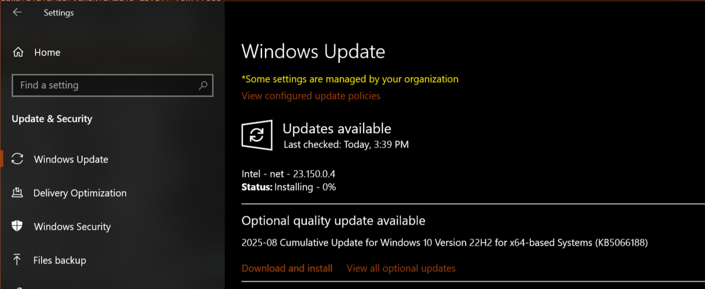
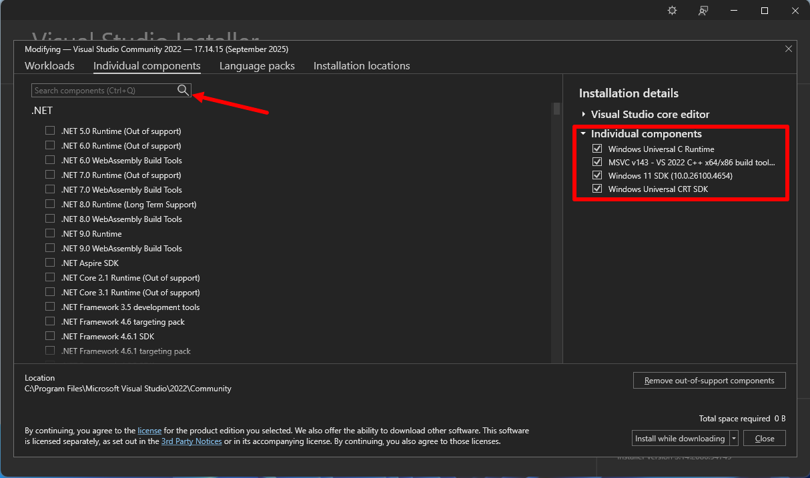
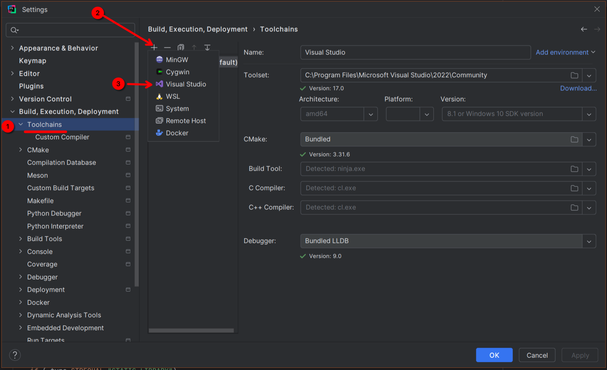
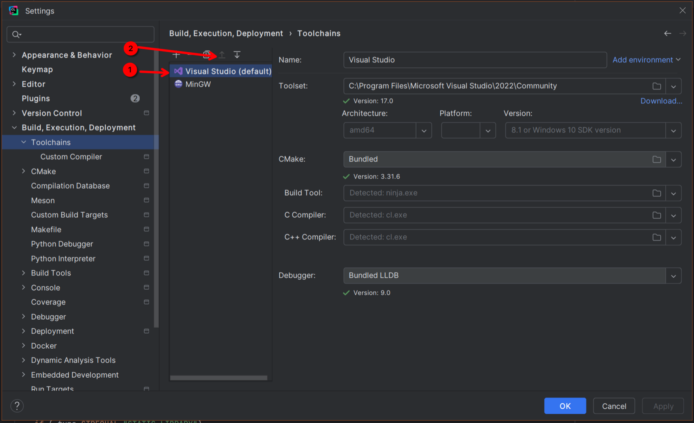
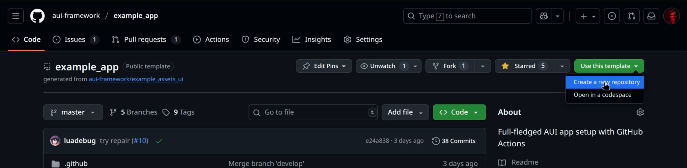
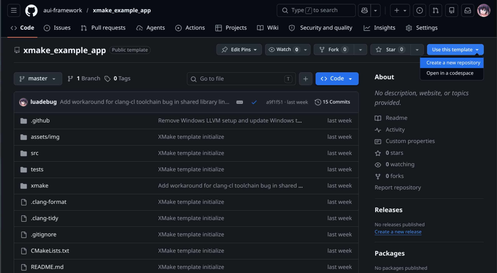
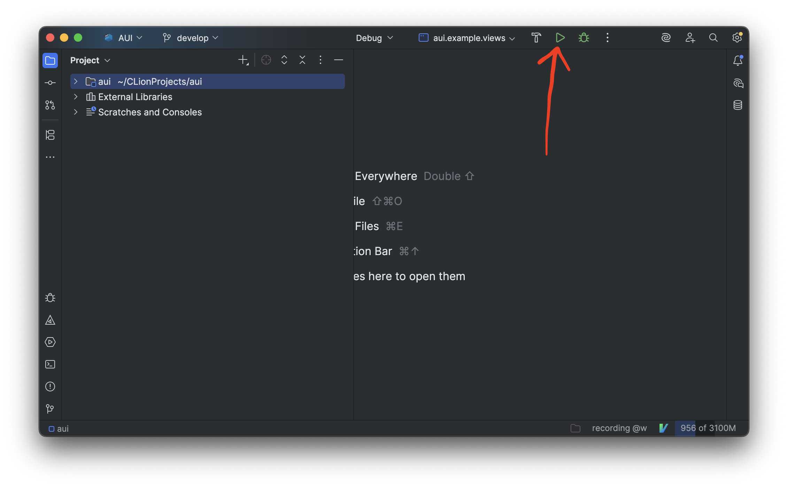
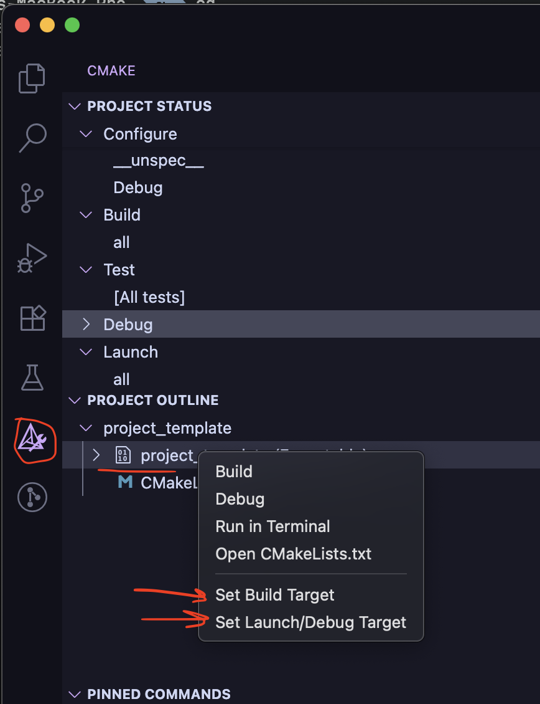
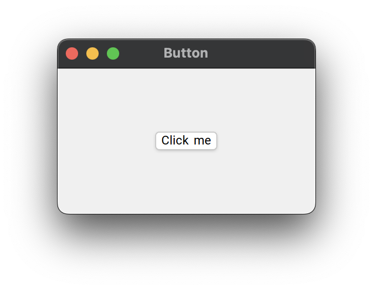

# Getting started with AUI

## IDE

=== ":simple-clion: CLion"
    
    - **Recommended** as "out of the box" crossplatform solution.
    - Has free version for non-commercial development.
    - No additional setup required.
    
=== ":material-microsoft-visual-studio-code: VS Code"
    
    - Install following extensions:
    
       | Extension                                                                                                  | Description                                                           |
       | ---------------------------------------------------------------------------------------------------------- | --------------------------------------------------------------------- |
       | [cpp tools pack](https://marketplace.visualstudio.com/items?itemName=ms-vscode.cpptools-extension-pack)    | Introduces basic C/C++ support and CMake integration.                 |
       | [vscode-clangd](https://marketplace.visualstudio.com/items?itemName=llvm-vs-code-extensions.vscode-clangd) | C++ language server for extensive code navigation, autocomplete, etc. |
    
    - Add these lines to your `settings.json` (++f1++ `> Preferences: Open User Settings (JSON)`):
       
       ```json title="settings.json"
       "clangd.arguments": [
           "--compile-commands-dir=build/"
       ],
       ```

---

## OS prerequirements

=== ":fontawesome-brands-windows: Windows"
    
    !!! success "Install Windows updates"
        
        You may want to ignore this, but in case of errors, please ensure you have installed Windows updates.
        
        
    
    !!! success "Install MSVC compiler"
        
        :simple-clion: **CLion** comes with MinGW by default. It works okayish, but we recommend using de-facto standard
        compiler for Windows instead.

        :material-microsoft-visual-studio-code: **VS Code** does not come with any compiler by default.
        
        You are not forced to use Visual Studio IDE, you can use whatever IDE you want. We just want the compiler part.
        
        Visual Studio Community edition is sufficient.
        
        Install [msvc](https://visualstudio.microsoft.com/vs/community/) or clang, if you haven't already, and reboot.
        
        Press ++win++, type `Visual Studio Installer` and launch.
        
        Choose `Individual components` tab.
        
        
        
        Search and select the following components:
        
        1. `Windows Universal C Runtime`
        2. `MSVC v142` or newer
        3. `Windows 10 SDK` or newer
        4. `Windows Universal CRT SDK`
        
        Click `Install`.
        
        Don't forget to reboot!

    !!! success "Configure CLion to use MSVC compiler instead of MinGW"

        While you can use MinGW for your AUI project, it is recommended to use commonly accepted compiler for Windows.

        If you use :material-microsoft-visual-studio-code: **VS Code**, it will pick up the correct compiler
        automatically.
         
        If you use :simple-clion: **CLion**:

        1. ++ctrl+alt+s++, navigate to "Build, Execution, Deployment" > "Toolchains".
        2. Press `+`.
        3. Choose Visual Studio. CLion should pick up it automatically.
        
        
        
        1. Select Visual Studio.
        2. Press "arrow up" button to raise priority. **Visual Studio compiler should be by default!**
        3. Press OK.
        
        

=== ":material-apple-finder: macOS"

    Install Xcode.


=== ":fontawesome-brands-ubuntu: Ubuntu"

    Install following dependencies:

    ```bash
    sudo apt update
    sudo apt install pkg-config libglew-dev zlib1g-dev libssl-dev libcurl4-openssl-dev libgtk-3-dev libdbus-1-dev libfontconfig-dev ninja-build libpulse-dev git cmake g++
    ```

=== ":fontawesome-brands-fedora: Fedora"
    
    Install following dependencies:

    ```bash
    sudo dnf install fontconfig-devel gtk3-devel dbus-devel libXi libglvnd-devel libstdc++-static glew-devel pulseaudio-libs-devel git cmake g++
    ```

---

## Installation

AUI does not provide "traditional" installation methods that involve manual downloading and deploying; instead, package
managers are used to ensure easily reproducible builds. They compile and link all required dependencies automatically
to free you from dependency management and focus you right to development of your application.

=== "AUI App Template"

    === "CMake"

        You can use our [app-template] to set up a new project quickly with [CLANG_FORMAT], Github Actions and other
        features out-of-the-box. The template is based on CMake and [aui.boot].
        
        Clone `https://github.com/aui-framework/example_app` with your IDE or via terminal:
        
        ```bash
        git clone https://github.com/aui-framework/example_app
        ```
        
        and open that directory in your IDE.

        ??? tip "Recommended: Create a new repo"
        
            From [app-template] repository, you can generate a completely separate repo with clean git history:
            
            1. Open [http://github.com/aui-framework/example_app](http://github.com/aui-framework/example_app)
            2. Click `Create a new repository`.
                
               
            
            3. Clone your own repo into IDE.

    === "XMake"

        A full-fledged XMake-based app template is available at
        [github.com/aui-framework/xmake_example_app](https://github.com/aui-framework/xmake_example_app).
        It comes pre-configured with GitHub Actions CI/CD, `.clang-format`, `.clang-tidy`, Valgrind suppression,
        auto-updating (Windows), and a ready-to-run AUI window — everything you need to start shipping an app.

        

        !!! warning "AUI version support"
            The XMake app template currently targets **AUI v7.1.2**. Newer versions of AUI (v8.x and above)
            are not yet supported. Track progress in the
            [xmake_example_app repository](https://github.com/aui-framework/xmake_example_app).

        ??? tip "Recommended: Create a new repo from the template"

            1. Open [https://github.com/aui-framework/xmake_example_app](https://github.com/aui-framework/xmake_example_app)
            2. Click `Use this template` → `Create a new repository`.
            
            3. Clone your new repo and open it in your IDE.

        The template includes the following GitHub Actions workflows:

        - **Build** — triggered on `push` and `pull_request`. Builds for all supported platforms, runs tests,
          generates installable packages, and prepares a GitHub Release draft.
        - **Code Quality** — triggered on `pull_request`. Runs `clang-tidy` static analysis and `valgrind`
          dynamic analysis on tests.

        To create a release, bump the version in `CMakeLists.txt` and push — the pipeline creates a GitHub Release
        draft for you automatically.

=== "Manual Setup"
    
    AUI provides support to several package managers, to choose at your own.

    === "AUI Boot"
        
        [aui.boot] is \*official\* way of using AUI. It is a CMake-based package manager that requires nothing but CMake.

        Download AUI.Boot (one-time):

        ```bash
        curl https://raw.githubusercontent.com/aui-framework/aui/refs/heads/master/aui.boot.cmake -o aui.boot.cmake
        ```

        Create `CMakeLists.txt`:
        
        ```cmake title="CMakeLists.txt"
        # Standard routine
        cmake_minimum_required(VERSION 3.16)
        project(project_template)
        
        # Use AUI.Boot
        include(aui.boot.cmake)
        
        # import AUI
        auib_import(
            aui https://github.com/aui-framework/aui 
            COMPONENTS core views
            VERSION v8.0.0-rc.8
            )
        
        
        # Create the executable. This function automatically links all sources from the src/ folder, creates CMake target and
        # places the resulting executable to bin/ folder.
        aui_executable(project_template)
        
        # Link required libs
        aui_link(project_template PRIVATE aui::core aui::views)
        ```
    
    === "CPM"
        
        [CMake's missing package manager](https://github.com/cpm-cmake/CPM.cmake) is a small CMake script for
        setup-free, cross-platform, reproducible dependency management.
        
        Download CPM to your project directory:
        
        ```bash
        mkdir -p cmake
        wget -O cmake/CPM.cmake https://github.com/cpm-cmake/CPM.cmake/releases/latest/download/get_cpm.cmake
        ```

        Then, create a `CMakeLists.txt`:
        
        ```cmake title="CMakeLists.txt"
        # Standard routine
        cmake_minimum_required(VERSION 3.16)
        project(project_template)
        
        # import AUI
        include(cmake/CPM.cmake)
        CPMAddPackage("gh:aui-framework/aui#v7.1.2")
        
        # Create the executable. This function automatically links all sources from the src/ folder, creates CMake target and
        # places the resulting executable to bin/ folder.
        aui_executable(project_template)
        
        # Link required libs
        aui_link(project_template PRIVATE aui::core aui::views)
        ```
    
    === "XMake"

        [XMake](https://xmake.io) is a lightweight, cross-platform build utility with built-in package management.
        It requires no external package manager — AUI is fetched and compiled automatically from [xmake-repo](https://github.com/xmake-io/xmake-repo).

        !!! warning "AUI version support"
            XMake package support currently targets **AUI v7.1.2**. Newer versions (v8.x and above) are not yet
            available in xmake-repo. If you need the latest AUI, use AUI Boot or CPM instead.

        !!! success "Install XMake"

            === ":fontawesome-brands-windows: Windows"

                Install via `winget` (recommended):

                ```bash
                winget install xmake
                ```

                Or download the installer from [xmake.io](https://xmake.io/#/guide/installation) and run it.

                !!! note
                    After installation, reopen your terminal so that `xmake` is available on the `PATH`.

            === ":material-apple-finder: macOS"

                Install via [Homebrew](https://brew.sh):

                ```bash
                brew install xmake
                ```

            === ":fontawesome-brands-ubuntu: Ubuntu / :fontawesome-brands-debian: Debian"

                ```bash
                curl -fsSL https://xmake.io/shget.text | bash
                ```

                Or install via `apt` (may be an older version):

                ```bash
                sudo add-apt-repository ppa:xmake-io/xmake
                sudo apt update
                sudo apt install xmake
                ```

            === ":fontawesome-brands-fedora: Fedora / :fontawesome-brands-redhat: RHEL"

                ```bash
                curl -fsSL https://xmake.io/shget.text | bash
                ```

            Verify the installation:

            ```bash
            xmake --version
            ```

        !!! success "Create `xmake.lua`"

            Create the following `xmake.lua` in your project root:

            ```lua title="xmake.lua"
            -- Specify available build configurations
            add_rules("mode.release", "mode.debug")

            -- Output compile_commands.json for clangd / VS Code IntelliSense
            add_rules("plugin.compile_commands.autoupdate", {outputdir = ".vscode", lsp = "clangd"})

            -- AUI requires C++20
            set_languages("c++20")

            -- Fetch AUI v7.1.2 from xmake-repo (latest version supported via XMake)
            add_requires("aui v7.1.2")

            -- Define the executable target
            target("project_template")
                -- Collect all .cpp files from the src/ directory
                add_files("src/*.cpp")
                add_includedirs("src")
                -- Link AUI with only the components you need
                add_packages("aui", {components = {"core", "image", "views", "xml"}})
                -- Group AUI components into link groups to resolve circular dependencies
                add_linkgroups("aui.views", "aui.xml", "aui.image", "aui.core", {whole = true})
            ```

        !!! success "Create `src/` directory and entry point"

            XMake picks up all `.cpp` files from `src/` automatically. Create at minimum:

            ```cpp title="src/main.cpp"
            #include <AUI/Platform/Entry.h>
            #include <AUI/Platform/AWindow.h>

            AUI_ENTRY {
                _new<AWindow>("Hello AUI", 300_dp, 200_dp)->show();
                return 0;
            }
            ```

        !!! success "Build and run"

            ```bash
            xmake          # configure dependencies and build
            xmake run      # run the resulting executable
            ```

            On the first run, XMake will download and compile AUI and all its dependencies. This may take a few minutes.
            Subsequent builds are incremental and fast.

        ??? tip "Switching between Debug and Release"

            ```bash
            xmake f -m debug    # switch to debug configuration
            xmake               # rebuild
            xmake f -m release  # switch back to release
            xmake
            ```

        ??? tip "VS Code integration"

            The `plugin.compile_commands.autoupdate` rule in `xmake.lua` automatically generates
            `.vscode/compile_commands.json` on every build. This enables full IntelliSense and
            code navigation in VS Code via the [vscode-clangd](https://marketplace.visualstudio.com/items?itemName=llvm-vs-code-extensions.vscode-clangd) extension — no additional configuration needed.

        See [Minimal UI Template XMake](minimal-ui-template-xmake.md) for a full ready-to-use example with
        `MainWindow`.

    [aui_executable] hooks all CPP files from `src/` directory. You need to create `src/` directory and a CPP file in
    it.
    
    <!-- aui:include examples/ui/button1/src/main.cpp title="src/main.cpp" -->


!!! note "Why CMake or IDE doesn't recognize a new CPP file?"

    This indicates that the IDE's build system needs to be initialized or refreshed.
    
    [Reload](troubleshoot-list.md#BUILD_CACHE_INVALIDATION) CMake project to hook up a newly added CPP file:

    === ":simple-clion: CLion"
        
        `File` > `Reload CMake Project` or right-click on `CMakeLists.txt` > `Load/Reload CMake project`.

    === ":material-microsoft-visual-studio-code: VS Code"
        
        1. Please make sure you have followed setup procedure listed in the beginning on this page.
        2. ++f1++ `>CMake: Configure`. If it asks for a toolchain, choose `Unspecified`.

    === ":octicons-terminal-16: Terminal"

        ```bash
        cmake -S . -B build
        ```

---

## Build and Run Your App

=== ":simple-clion: CLion"
  
    `Run` -> `Run "project name"` or green arrow in top right corner.
    
    

=== ":material-microsoft-visual-studio-code: VS Code"
  
    1. ++f1++ `>CMake: Configure`. If it asks for a toolchain, choose `Unspecified`.
    2. Choose CMake logo in the left panel (where the extensions tab live).
    3. Right click on project's target > `Set Build target` and `Set Launch/Debug target`.
       
    4. ++f1++ `>CMake: Debug`.

=== ":octicons-terminal-16: Terminal"

    ```bash
    cmake -S . -B build
    cmake --build build
    ```



See [layout managers](layout-managers.md) for more info about layout managers.

See [ASS](ass.md) for more info about styling.

See [examples] for examples.
