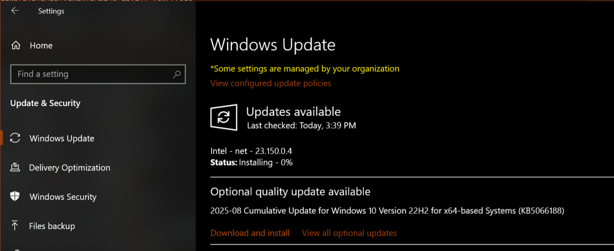

# Getting started with AUI

## IDE

=== ":simple-clion: CLion"
    
    - **Recommended** as "out of the box" crossplatform solution.
    - Has free version for non-commercial development.
    - No additional setup required.
    
=== ":material-microsoft-visual-studio-code: VS Code"
    
    - Install following extensions:
    
       | Extension                                                                                                  | Description                                                           |
       | ---------------------------------------------------------------------------------------------------------- | --------------------------------------------------------------------- |
       | [cpp tools pack](https://marketplace.visualstudio.com/items?itemName=ms-vscode.cpptools-extension-pack)    | Introduces basic C/C++ support and CMake integration.                 |
       | [vscode-clangd](https://marketplace.visualstudio.com/items?itemName=llvm-vs-code-extensions.vscode-clangd) | C++ language server for extensive code navigation, autocomplete, etc. |
    
    - Add these lines to your `settings.json` (++f1++ `> Preferences: Open User Settings (JSON)`):
       
       ```json title="settings.json"
       "clangd.arguments": [
           "--compile-commands-dir=build/"
       ],
       ```

---

## OS prerequirements

=== ":fontawesome-brands-windows: Windows"
    
    !!! success "Install Windows updates"
        
        You may want to ignore this, but in case of errors, please ensure you have installed Windows updates.
        
        
    
    !!! success "Install msvc"
        
        :simple-clion: CLion comes with MinGW by default. **MinGW is not supported**!
        
        You are not forced to use Visual Studio IDE, you can use whatever IDE you want. We just want the compiler part.
        
        Visual Studio Community edition is sufficient.
        
        Install [msvc](https://visualstudio.microsoft.com/vs/community/) or clang, if you haven't already, and reboot.
        
        Press ++win++, type `Visual Studio Installer` and launch.
        
        Choose `Individual components` tab.
        
        
        
        Search and select the following components:
        
        1. `Windows Universal C Runtime`
        2. `MSVC v142` or newer
        3. `Windows 10 SDK` or newer
        4. `Windows Universal CRT SDK`
        
        Click `Install`.
        
        Don't forget to reboot!

    !!! success "Configure CLion to use MSVC instead of MinGW"
         
        If you use :simple-clion: CLion:

        1. ++ctrl+shift+s++, navigate to "Build, Execution, Deployment" > "Toolchains".
        2. Press `+`.
        3. Choose Visual Studio. CLion should pick up it automatically.
        
        
        
        1. Select Visual Studio.
        2. Press "arrow up" button to raise priority. **Visual Studio compiler should be by default!**
        3. Press OK.
        
        

=== ":material-apple-finder: macOS"

    Install Xcode.


=== ":fontawesome-brands-ubuntu: Ubuntu"

    Install following dependencies:

    ```bash
    sudo apt update
    sudo apt install pkg-config libglew-dev zlib1g-dev libssl-dev libcurl4-openssl-dev libgtk-3-dev libdbus-1-dev libfontconfig-dev ninja-build libpulse-dev git cmake g++
    ```

=== ":fontawesome-brands-fedora: Fedora"
    
    Install following dependencies:

    ```bash
    sudo dnf install fontconfig-devel gtk3-devel dbus-devel libXi libglvnd-devel libstdc++-static glew-devel pulseaudio-libs-devel git cmake g++
    ```

---

## Installation

AUI does not provide "traditional" installation methods that involve manual downloading and deploying; instead, package
managers are used to ensure easily reproducible builds. They compile and link all required dependencies automatically
to free you from dependency management and focus you right to development of your application.

=== "AUI App Template"
    
    You can use our [app-template] to set up a new project quickly with [CLANG_FORMAT], Github Actions and other
    features out-of-the-box. The template is based on CMake and [aui.boot].
    
    Clone `https://github.com/aui-framework/example_app` with your IDE or via terminal:
    
    ```bash
    git clone https://github.com/aui-framework/example_app
    ```
    
    and open that directory in your IDE.

    ??? tip "Recommended: Create a new repo"
    
        From [app-template] repository, you can generate a completely separate repo with clean git history:
        
        1. Open [http://github.com/aui-framework/example_app](http://github.com/aui-framework/example_app)
        2. Click `Create a new repository`.
            
           
        
        3. Clone your own repo into IDE.

=== "Manual Setup"
    
    AUI provides support to several package managers, to choose at your own.

    === "AUI Boot"
        
        [aui.boot] is \*official\* way of using AUI. It is a CMake-based package manager that requires nothing but CMake.
        
        ```cmake title="CMakeLists.txt"
        # Standard routine
        cmake_minimum_required(VERSION 3.16)
        project(project_template)
        
        # Use AUI.Boot
        file(
            DOWNLOAD 
            https://raw.githubusercontent.com/aui-framework/aui/master/aui.boot.cmake 
            ${CMAKE_CURRENT_BINARY_DIR}/aui.boot.cmake)
        include(${CMAKE_CURRENT_BINARY_DIR}/aui.boot.cmake)
        
        # import AUI
        auib_import(
            aui https://github.com/aui-framework/aui 
            COMPONENTS core views
            VERSION v8.0.0-rc.8
            )
        
        
        # Create the executable. This function automatically links all sources from the src/ folder, creates CMake target and
        # places the resulting executable to bin/ folder.
        aui_executable(project_template)
        
        # Link required libs
        aui_link(project_template PRIVATE aui::core aui::views)
        ```
    
    === "CPM"
        
        [CMake's missing package manager](https://github.com/cpm-cmake/CPM.cmake) is a small CMake script for
        setup-free, cross-platform, reproducible dependency management.
        
        Download CPM to your project directory:
        
        ```bash
        mkdir -p cmake
        wget -O cmake/CPM.cmake https://github.com/cpm-cmake/CPM.cmake/releases/latest/download/get_cpm.cmake
        ```

        Then, create a `CMakeLists.txt`:
        
        ```cmake title="CMakeLists.txt"
        # Standard routine
        cmake_minimum_required(VERSION 3.16)
        project(project_template)
        
        # import AUI
        include(cmake/CPM.cmake)
        CPMAddPackage("gh:aui-framework/aui#v7.1.2")
        
        # Create the executable. This function automatically links all sources from the src/ folder, creates CMake target and
        # places the resulting executable to bin/ folder.
        aui_executable(project_template)
        
        # Link required libs
        aui_link(project_template PRIVATE aui::core aui::views)
        ```
    
    [aui_executable] hooks all CPP files from `src/` directory. You need to create `src/` directory and a CPP file in
    it.
    
    <!-- aui:include examples/ui/button1/src/main.cpp title="src/main.cpp" -->


!!! note "Why CMake or IDE doesn't recognize a new CPP file?"

    This indicates that the IDE's build system needs to be initialized or refreshed.
    
    [Reload](troubleshoot-list.md#BUILD_CACHE_INVALIDATION) CMake project to hook up a newly added CPP file:

    === ":simple-clion: CLion"
        
        `File` > `Reload CMake Project` or right-click on `CMakeLists.txt` > `Load/Reload CMake project`.

    === ":material-microsoft-visual-studio-code: VS Code"
        
        1. Please make sure you have followed setup procedure listed in the beginning on this page.
        2. ++f1++ `>CMake: Configure`. If it asks for a toolchain, choose `Unspecified`.

    === ":octicons-terminal-16: Terminal"

        ```bash
        cmake -S . -B build
        ```

---

## Build and Run Your App

=== ":simple-clion: CLion"
  
    `Run` -> `Run "project name"` or green arrow in top right corner.
    
    

=== ":material-microsoft-visual-studio-code: VS Code"
  
    1. ++f1++ `>CMake: Configure`.
    2. Choose CMake logo in the left panel (where the extensions tab live).
    3. Right click on project's target > `Set Build target` and `Set Launch/Debug target`.
       
    4. ++f1++ `>CMake: Debug`.
        For building examples:
    1. Press ++Ctrl+,++ and search for `Cmake Configure Args`.
    2. Press the `Add item` button and enter `-DAUI_BUILD_EXAMPLES=TRUE`.
       

=== ":octicons-terminal-16: Terminal"

    ```bash
    cmake -S . -B build
    cmake --build build
    ```


See [layout managers](layout-managers.md) for more info about layout managers.

See [ASS](ass.md) for more info about styling.

See [examples] for examples.
