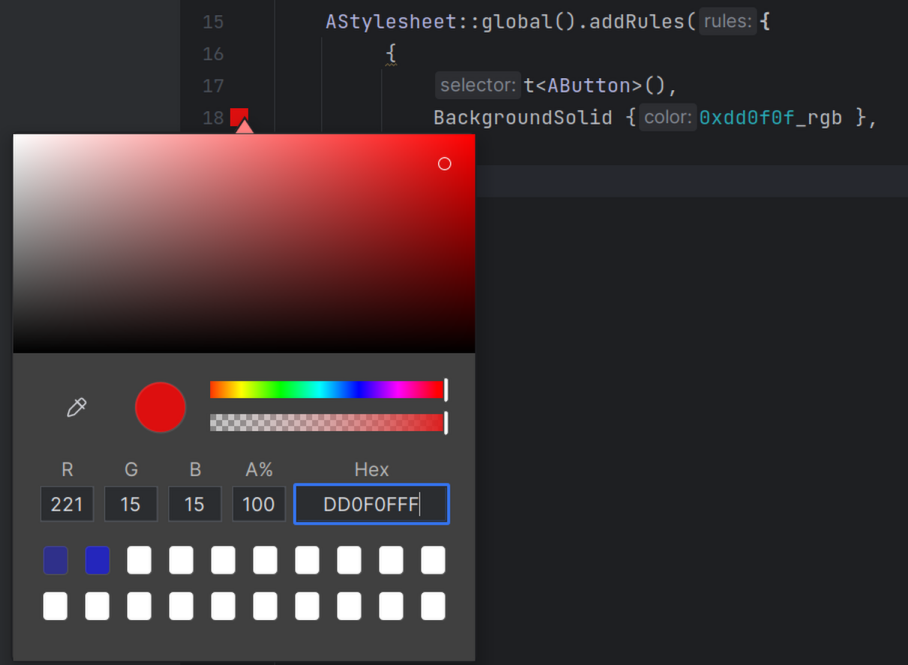

# IDE Plugins

AUI project offers extensions for common IDEs to improve user experience and quality-of-live during development of AUI
applications.

## CLion

- [JetBrains marketplace](https://plugins.jetbrains.com/plugin/26118-aui-framework-support)
- [Releases](https://github.com/aui-framework/ide-plugin-clion/releases)
- [Source code](https://github.com/aui-framework/ide-plugin-clion)
