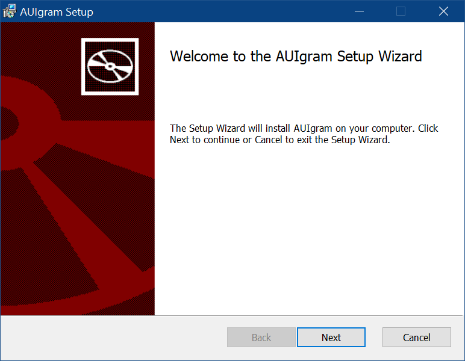

# App Packaging

Cross-platform app packaging is a large topic that involves various build systems, platform-specific tools and
techniques. AUI unifies package building process while still relying on `CMake` as the central build system.

AUI Framework focuses on minimizing efforts for AUI-based project to produce production-ready packages as easily as
possible. AUI refrains from self-promotion in placeholders and "default values"; instead it carefully uses the
information about your project passed to [aui_app] where needed.

AUI provides a convenient configure time variable for choosing target packaging method -
[AUI_APP_PACKAGING] "-DAUI_APP_PACKAGING=...". Furthermore, if you are using [AUI_BUILD_FOR] "-DAUI_BUILD_FOR=..."
(for cross-compiling), `AUI_APP_PACKAGING` is [not required](PACKAGING_WITH_AUI_BUILD_FOR) to specify. This page
provides full usage examples.

`AUI_APP_PACKAGING` and `AUI_BUILD_FOR` are handled by [aui_app].

[aui_app] is a CMake command provided by AUI that defines platform-specific technical information about your
application:

- Display name
- Icon
- Vendor (author) information
- Version
- Package id (if required by target platform)
- etc...

In addition, this command populates some `CPACK_*` variables (if undefined). This approach allows you not to bother
about various installation methods but also override the variables if needed by simply calling `set` on them, no matter
prior to or after `aui_app` invocation.

These adjustments are needed to configure the installer packages. AUI replaces installers' defaults with the information
passed to `aui_app`, such as app name, id, icon, license information, authors, etc. to produce production-ready packages
out of the box.

This guide covers various packaging techniques for all supported platforms.

!!! note

    This guide assumes you have already called [aui_app] inside your `CMakeLists.txt`.

## Windows

Historically, Windows has been associated with installers in the form of executable files (`exe`s) and Windows Installer
files (`msi`s), often downloaded from the internet. This method can be considered unsecure.

Although Windows offers its official store and numerous unofficial repositories for distributing software, many
developers still opt for traditional methods. This guide will cover the latter.

!!! note

    Guides about packaging for Windows assume you are running Windows with [Chocolatey](https://community.chocolatey.org/)
    preinstalled. This way the process is easily reproducible (i.e., on a CI/CD runner).

### Inno Setup { #INNOSETUP }

[\[CMake Documentation\]](https://cmake.org/cmake/help/latest/cpack_gen/innosetup.html)

 Installer with AUI's patches applied

Inno Setup is a free installer framework for Windows program by Jordan Russell and Martijn Laan.

```python
# install requirements
choco install innosetup

# standard CMake build process
mkdir build
cd build
cmake .. -DCMAKE_BUILD_TYPE=Release -DAUI_APP_PACKAGING=INNOSETUP
cmake --build . --config Release

# packaging
cpack . -c Release -B artifacts

# publishing
gh release upload ${{ github.ref }} artifacts/*.*
```

The script above produces a file `artifacts/<APP_NAME>-VERSION-windows-ARCH-setup.exe`, where `<APP_NAME>` is the `NAME`
arg of [aui_app] (unless not overridden by `CPACK_PACKAGE_FILE_NAME`).

@pythongen{aui_app_innosetup}

[aui_app] generates some image assets for the installer from your icon.

By default, in addition to branding adjustments (such as app logo and name), AUI configures INNOSETUP so the installer
won't prompt a UAC dialog (leverage to _admin privileges_). This way the installation process is more secure from
perspective of the end user. Moreover, installation to user's directory allows [updater] to work without prompting
leverage to admin privileges during update installation.

### AUI_PORTABLE_ZIP, AUI_PORTABLE_TGZ

!!! note

    This packaging method is AUI-specific and provided by `aui_app` via `AUI_APP_PACKAGING`.

This packaging method creates an `*.zip` or `*.tar.gz` archive with your application "preinstalled". After
unpacking, no extra actions are needed. The user can launch executable of your application directly.

!!! note

    [updater] requires ZIP portable to be published. Other archive formats such tar `tar.gz` are not supported.

```python
# standard CMake build process
mkdir build
cd build
cmake .. -DCMAKE_BUILD_TYPE=Release -DAUI_APP_PACKAGING=AUI_PORTABLE_ZIP
cmake --build . --config Release

# packaging
cpack . -c Release -B artifacts

# publishing
gh release upload ${{ github.ref }} artifacts/*.*
```

`AUI_PORTABLE_ZIP` appends `-portable` suffix to archive file name, if not overridden by `CPACK_PACKAGE_FILE_NAME`.

### WIX

[\[CMake Documentation\]](https://cmake.org/cmake/help/latest/cpack_gen/wix.html)



WIX is the installer framework that produces `msi` packages.

!!! note
    [updater] requires application to be installed in user's directory and thus AUI's autoupdating functionality can't
    be used with WIX.

```python
# install requirements
choco install wixtoolset

# standard CMake build process
mkdir build
cd build
cmake .. -DCMAKE_BUILD_TYPE=Release -DAUI_APP_PACKAGING=WIX
cmake --build . --config Release

# packaging
cpack . -c Release -B artifacts

# publishing
gh release upload ${{ github.ref }} artifacts/*.*
```

The script above produces a file `artifacts/<APP_NAME>-VERSION-windows-ARCH.msi`, where `<APP_NAME>` is the `NAME` arg
of [aui_app] (unless not overridden by `CPACK_PACKAGE_FILE_NAME`).

@pythongen{aui_app_wix}

[aui_app] generates some image assets for the installer from your icon.

 Installer with AUI's patches applied

## macOS

!!! note

    Guides about packaging for macOS assume you are running macOS with Xcode preinstalled.

The simplest and the most user-friendly installation method is `DragNDrop` which you are probably looking for.

### DragNDrop

[\[CMake Documentation\]](https://cmake.org/cmake/help/latest/cpack_gen/dmg.html)

The DragNDrop CPack generator creates a DMG image. When opened, a Finder window appears with your application and a
symlink to `/Applications`, effectively prompting the user to copy the application from the medium to his app library.

This packaging method for macOS covers non-install (portable) use case as well. If one chooses to keep your application
not in `/Applications` but in some other place they can do that intuitively by copying your application from DMG image
to whatever place they want.

Default DMG image produced by CPack is sparse: it's just a regular Finder window with sidebar and top bar showing
your application bundle and a symlink. [aui_app] configures CPack to rearrange icons and place a background
image so no extra configuration by an AUI-based project is needed:


```python
# standard CMake build process
mkdir build
cd build
cmake .. -DCMAKE_BUILD_TYPE=Release -DAUI_APP_PACKAGING=DragNDrop
cmake --build . --config Release

# packaging
cpack . -c Release -B artifacts

# publishing
gh release upload ${{ github.ref }} artifacts/*.*
```

The script above produces a file `artifacts/<APP_NAME>-VERSION-macos-ARCH.dmg`, where `<APP_NAME>` is the `NAME` arg of
[aui_app] (unless not overridden by `CPACK_PACKAGE_FILE_NAME`).

@pythongen{aui_app_dmg}

## Android and iOS

`-DAUI_BUILD_FOR=...` implies `AUI_APP_PACKAGING`, no further configuration is needed.

Please refer to [cross-compiling](docs/Crosscompiling.md).
