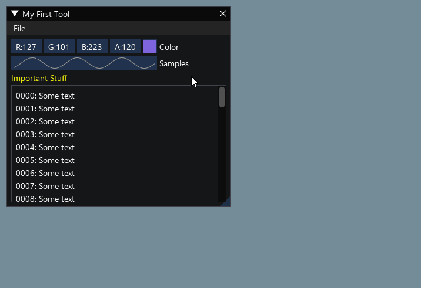

# Retained and immediate UI

This page describes specifics and differences of retained and immediate mode UIs, and how the latter was adopted to AUI.

## Retained Mode UI { #retained_ui }

Retained Mode UI is the traditional approach to building user interfaces that most developers are familiar with. In this
model, UI elements are created and persist in memory as a tree or graph structure. Think of it like arranging furniture
in a room - once you place the elements, they stay there until explicitly moved or removed.

```cpp
class MainWindow: public AWindow {
public:
    MainWindow() {
        setContents(Centered {
            // pain point: has to set initial value
            // pain point: has to use scary statements
            // instead of invoking a contract that
            // explicitly describes what the view
            // expects to receive and give
            mButton = _new<AButton>("0") AUI_LET {
                connect(it->clicked, me::increase);
            },
        });
    }
    
    void increase() {
        // pain point: has to manually maintain view's
        // state
        // pain point: has to somehow put together
        // business logic and UI state updates
        mButton->setText("{}"_format(++mCounter));
    }

private:
    _<AButton> mButton;
    int mCounter = 0;
};
```

When you create a button or a window in retained mode, it continues to exist even when not visible, maintaining its
state, properties, and position. This approach is what powers most desktop applications, web browsers, and mobile apps.
Systems like Qt Widgets, GTK, Swing, WinAPI, or the HTML DOM are classic examples of retained mode UIs.

## Immediate Mode UI { #immediate_ui }

Immediate Mode UI takes a radically different approach. Instead of maintaining persistent UI elements, it rebuilds the
entire interface from scratch every frame. Imagine having to redraw everything on a whiteboard multiple times per
second - that's essentially what immediate mode UI does.

This approach, popularized by libraries like Dear ImGui, is particularly prevalent in game development and debugging
tools. The UI is described procedurally, with the application explicitly controlling the state. Rather than creating a
button that persists in memory, you essentially say "draw a button here" every frame, and if it's clicked, react
immediately.

```cpp
// Create a window called "My First Tool", with a menu bar.
ImGui::Begin("My First Tool", &my_tool_active, ImGuiWindowFlags_MenuBar);
if (ImGui::BeginMenuBar())
{
    if (ImGui::BeginMenu("File"))
    {
        if (ImGui::MenuItem("Open..", "Ctrl+O")) { /* Do stuff */ }
        if (ImGui::MenuItem("Save", "Ctrl+S"))   { /* Do stuff */ }
        if (ImGui::MenuItem("Close", "Ctrl+W"))  { my_tool_active = false; }
        ImGui::EndMenu();
    }
    ImGui::EndMenuBar();
}

// Edit a color stored as 4 floats
ImGui::ColorEdit4("Color", my_color);

// Generate samples and plot them
float samples[100];
for (int n = 0; n < 100; n++)
    samples[n] = sinf(n * 0.2f + ImGui::GetTime() * 1.5f);
ImGui::PlotLines("Samples", samples, 100);

// Display contents in a scrolling region
ImGui::TextColored(ImVec4(1,1,0,1), "Important Stuff");
ImGui::BeginChild("Scrolling");
for (int n = 0; n < 50; n++)
    ImGui::Text("%04d: Some text", n);
ImGui::EndChild();
ImGui::End();
```



This approach is convenient for dynamic interfaces, at the cost of reevaluating layout each frame and drawing everything
from scratch.

## Practical Implications

Immediate mode UI can't be really used in most applications due to high resource consumption, especially on mobile
platforms. However, the expressiveness and stateless approach give significant benefits in terms of software
development speed.

Modern UI frameworks (SwiftUI, QML, Jetpack Compose, including AUI) actually represent a hybrid approach that blends
concepts from both retained and immediate mode UIs. They're often called "declarative UI frameworks".

These frameworks create what appears to be an immediate-mode-like developer experience while maintaining
retained-mode-like performance benefits.

With declarative syntax, the code style feels similar to immediate mode - you describe what you want the UI to look like
at the given moment, rather than how to change it.

```cpp
class MainWindow: public AWindow {
public:
    MainWindow() {
        setContents(Centered {
            // 1. you don't need to set the initial string "0"
            Button {
                .text = AUI_REACT("{}"_format(mCounter)),
                .onClick = { me::increase },
            },
        });
    }
    
    void increase() {
        // 2. the click handler was stripped down to
        // "business logic" only, no explicit actions
        // to UI.
        ++mCounter;
    }

private:
    AProperty<int> mCounter = 0;
};
```

Behind the scenes, these frameworks maintain a virtual representation of the UI (similar to retained mode) but update it
efficiently through diffing algorithms. The visual representation is reevaluated only if the state is changed.

They use sophisticated [state management systems](property-system.md) that track dependencies and trigger
recompositions only when needed. This is more efficient than pure immediate mode (which redraws everything) but more
automated than traditional retained mode.

The key innovation is that they provide the mental model and simplicity of immediate mode while maintaining the
performance benefits of retained mode. This is why they're often called "declarative UI frameworks" rather than being
categorized as either retained or immediate mode.

## AUI specifics

AUI is historically a retained mode UI. However, it has adopted the "hybrid mode" concept. This is why most of AUI's
views components provide "a traditional way", which consists of creating an object and maintaining its state manually
via setters; and a "declarative way", which immediately describes the behavior and relationship of a view to the
properties, the latter control the state.

In the examples above, we've used [AButton] for retained mode UI, and its declarative notation,
`declarative::Button`, which accepts properties to control it. The latter is a *declarative contract*.

<!-- aui:snippet aui.views/src/AUI/View/AButton.h declarative_example -->

The declarative contracts are implemented as C++ structures, taking advantage of C++20's aggregate initialization to
provide a named-argument syntax. This makes the view's requirements and capabilities immediately obvious to developers
while reducing the amount of boilerplate code needed to create and manage views.

AUI allows you to choose using between retained and declarative mode. Under the hood, both `_new<AButton>` and
[declarative::Button] evaluate to creating a new instance of `_<AButton>`, which allows you to fall back to retained
mode in declarative UIs if necessary. Due to growing expectations in regard to dynamism and responsiveness, we strongly
suggest using declarative mode only.

A good example for preferring retained mode to declarative is a simple text editor, where everything goes around of a
single view.

## Why not a purely functional model (Jetpack Compose / immediate mode)? { #why_not_fp }

A frequently asked design question is whether AUI should have gone the "a view is just a function call, and the tree is
rebuilt on every change" route, like Jetpack Compose (functional recomposition) or Dear ImGui (immediate mode), instead
of the current SwiftUI-like model based on persistent view objects and declarative contracts.

The short answer: the current model is a deliberate fit for a C++ framework targeting desktop, mobile and embedded
platforms. Adopting a pure "rebuild the tree" model would trade away AUI's core performance guarantees for little
practical gain.

### What AUI actually is

AUI is a **retained-mode** framework:

- The UI is a persistent tree of reference-counted view objects (`_<AView>`), whose children are stored in a plain
  container (`AVector<_<AView>>`).
- The declarative `Vertical { a, b }` syntax is C++20 aggregate initialization over lightweight factory types. It runs
  **once** to build that tree.
- Reactivity (`AProperty` / `APropertyPrecomputed` / `AUI_REACT` + signal/slot
  `connect`) **mutates the existing views in place** through setters. It does not re-run the building lambda.
- Layout is recomputed **lazily, only when invalidated** (a dirty flag propagated by `markMinContentSizeInvalid` (in older versions) / `requestLayout` (in newer versions)), never unconditionally per frame.

In other words, AUI already provides the immediate-mode-like *developer experience* while keeping retained-mode
*performance*.

### Why the "everything is a function, rebuild on change" model does not fit

1. **Recomposition needs a heavy runtime that C++ neither has nor wants.** Compose's "call a function, the runtime
   figures out what to redraw" magic relies on a compiler plugin, a slot table and positional memoization
   (`remember`). Emulating that in C++ would mean shipping a large runtime and giving up the zero-overhead,
   predictable behavior C++ developers expect. AUI gets the equivalent result cheaply: dependencies are tracked
   automatically inside `AUI_REACT` via a `DependencyObserverScope`, with no global recomposition runtime.

2. **Rebuilding subtrees defeats the main advantage of retained mode — targeted mutation.** Today, changing an
   `AProperty` invokes a **single setter on an existing object**. A pure functional model would either
   rebuild subtrees (heap allocations plus relayout) or diff them anyway — effectively reinventing a retained tree under
   the hood, but behind a more expensive front end.

3. **AUI is intentionally not immediate mode, precisely because of resource usage.** As noted above, immediate mode is
   impractical for most applications, especially on mobile, because it re-evaluates layout and redraws everything every
   frame.

### AUI already takes the best of the functional approach - locally

Importantly, AUI does not have to choose between "everything is a function" and "everything is an object". It is a
hybrid, and it applies functional decomposition *surgically*, exactly where structural dynamism is needed:

- `AUI_REACT(expr)` is effectively "a function returning a value", lazily recomputed only when its dependencies change
  (see `APropertyPrecomputed`).
- `aui::experimental::Dynamic { AUI_REACT(...) }` is "a function returning a view"; it swaps a **single** subtree via
  `ALayoutInflater` when its input changes. This is functional style, but localized.
- `AUI_DECLARATIVE_FOR` / `AForEachUI` is "a function that builds a row from an item", but with a key-based view cache
  and virtualization inside an `AScrollArea` — conceptually Compose's `LazyColumn`, implemented on top of a retained
  tree.

So functional expressiveness is **available as an opt-in** where it is justified, while the default path stays a cheap
in-place mutation.

### Takeaway on ergonomics

The right lesson to borrow from Compose is **decomposition into small component functions**, not the recomposition
model. Prefer writing UI as a set of small factories that return a view:

```cpp
_<AView> notePreview(const _<Note>& note);
_<AView> noteEditor(const _<Note>& note);
```

Each such function is a "component" that is invoked once; dynamism is then expressed through `AProperty`,
`AUI_REACT` and `Dynamic`. This keeps the code readable (and avoids pushing a single, enormous expression through the
compiler) without giving up retained-mode performance.

