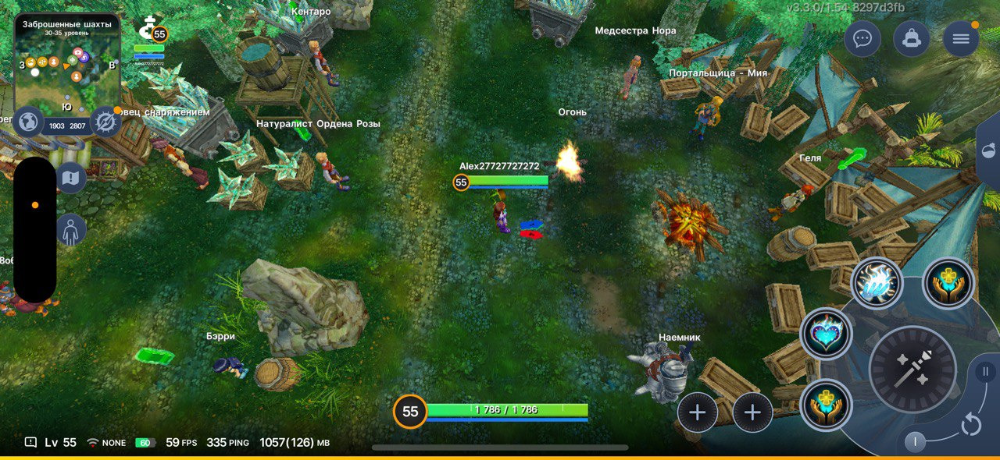

# UI Building Overview

AUI Framework provides a comprehensive set of tools and libraries for building robust, scalable, and maintainable user
interfaces. With its modular architecture and extensive feature set, developers can create complex UI components with
ease. See [getting-started] for quick start.

## Views

[Views](useful_views.md) are basic units to build UIs with AUI. There is a wide range of pre-built views for common UI
elements, such as buttons, labels, and text inputs.


## Layout

[Layout](layout-managers.md) is flexible and customizable way of managing your views in a logical and visually
appealing manner. From simple linear layouts to complex grid-based adaptive arrangements.


## Styles

[ASS](ass.md) supports for custom themes and styling using CSS-like syntax. Customize the look and feel of your UI
using robust styling and theming capabilities.



## Event handling with signal-slot

[signal_slot] can be used to handle UI events and respond to them accordingly.

```cpp
mOkButton = _new<AButton>("OK");
connect(mOkButton->clicked, [] { 
    ALogger::info("Example") << "The button was clicked";
});
```

## Data Binding

[Data binding](property-system.md), based on [signal_slot] "signal-slot", allows to establish a connection between
UI and application data objects.


## Devtools

[AUI Devtools](devtools.md) provide a set of features that makes it easier to design, test, and debug your UI
components. With visual debugging tools, and more, you can streamline your development workflow and focus on building
amazing user experiences.


## API Reference

- [All Views](useful_views.md)
- [ASS](ass.md)
    - [Selectors](ass_selectors.md)
    - [Properties](ass_properties.md)
