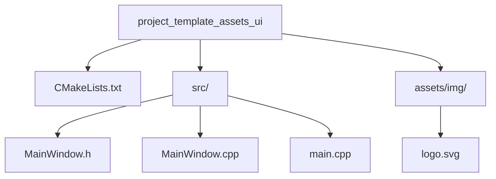

# Minimal UI Template with Assets

<!-- aui:example ui -->
Minimal UI boilerplate template with [aui-assets].


## Source Code
### Project Structure




---
### CMakeLists.txt
```cmake
# Standard routine
cmake_minimum_required(VERSION 3.16)
project(project_template_assets_ui)

set(AUI_VERSION v8.0.0-rc.8)

# Use AUI.Boot
file(
        DOWNLOAD
        https://raw.githubusercontent.com/aui-framework/aui/${AUI_VERSION}/aui.boot.cmake
        ${CMAKE_CURRENT_BINARY_DIR}/aui.boot.cmake)
include(${CMAKE_CURRENT_BINARY_DIR}/aui.boot.cmake)

# import AUI
auib_import(aui https://github.com/aui-framework/aui
        COMPONENTS core views
        VERSION ${AUI_VERSION})


# Create the executable. This function automatically links all sources from the src/ folder,
# creates CMake target and places the resulting executable to bin/ folder.
aui_executable(${PROJECT_NAME})

# Link required libs
aui_link(${PROJECT_NAME} PRIVATE aui::core aui::views)

aui_compile_assets(${PROJECT_NAME})
```

### src/MainWindow.h

```cpp
#pragma once

#include <AUI/Platform/AWindow.h>

class MainWindow: public AWindow {
public:
    MainWindow();
};
```
### src/MainWindow.cpp
```cpp
#include "MainWindow.h"
#include <AUI/Util/UIBuildingHelpers.h>
#include <AUI/View/ALabel.h>
#include <AUI/View/AButton.h>
#include <AUI/Platform/APlatform.h>
#include <AUI/View/ADrawableView.h>

using namespace declarative;

MainWindow::MainWindow(): AWindow("Project template app", 300_dp, 200_dp) {
    setContents(
        Centered{
            Vertical{
                Centered { Icon { ":img/logo.svg" } AUI_OVERRIDE_STYLE { FixedSize(64_dp) } },
                Centered { Label { "Hello world from AUI!" } },
                _new<AButton>("Visit GitHub repo").connect(&AView::clicked, this, [] {
                    APlatform::openUrl("https://github.com/aui-framework/aui");
                }),
                _new<AButton>("Visit docs").connect(&AView::clicked, this, [] {
                    APlatform::openUrl("https://aui-framework.github.io/");
                }),
                _new<AButton>("Submit an issue").connect(&AView::clicked, this, [] {
                    APlatform::openUrl("https://github.com/aui-framework/aui/issues/new");
                }),
            }
        }
    );
}
```

### src/main.cpp
```cpp
#include <AUI/Platform/Entry.h>
#include "MainWindow.h"

AUI_ENTRY {
    _new<MainWindow>()->show();
    return 0;
};
```

This example is located outside AUI's source tree. Checkout its
[repository](https://github.com/aui-framework/example_assets_ui).

