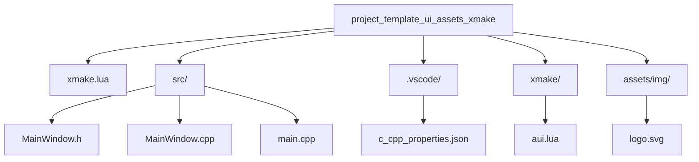

# Minimal UI Template XMake with Assets

<!-- aui:example ui -->
Minimal UI boilerplate template XMake with [aui-assets].

## Source Code
### Project Structure

---

### xmake.lua
<!-- aui:include examples/ui/minimal_ui_assets_xmake/xmake.lua -->

### xmake/aui.lua
<!-- aui:include examples/ui/minimal_ui_assets_xmake/xmake/aui.lua -->

### src/MainWindow.h
<!-- aui:include examples/ui/minimal_ui_assets_xmake/src/MainWindow.h -->

### src/MainWindow.cpp
<!-- aui:include examples/ui/minimal_ui_assets_xmake/src/MainWindow.cpp -->

### src/main.cpp
<!-- aui:include examples/ui/minimal_ui_assets_xmake/src/main.cpp -->

### .vscode/c_cpp_properties.json
<!-- aui:include examples/ui/minimal_ui_assets_xmake/.vscode/c_cpp_properties.json -->
